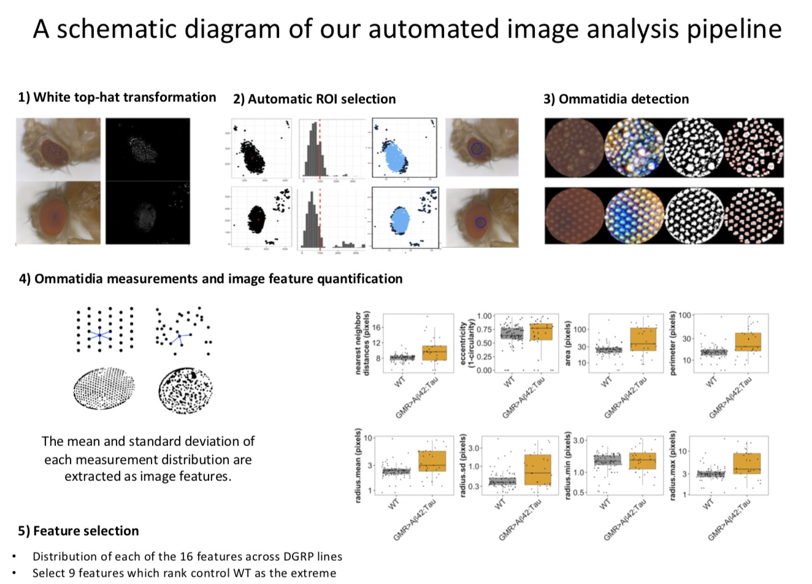
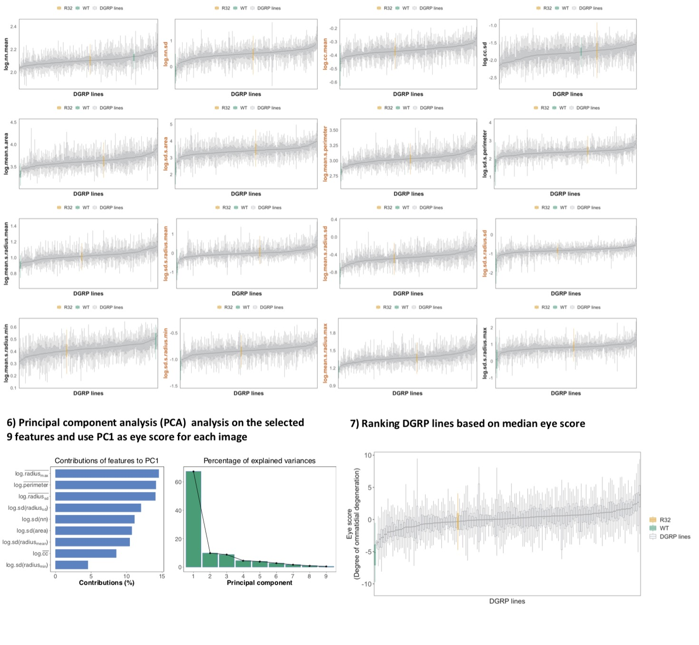
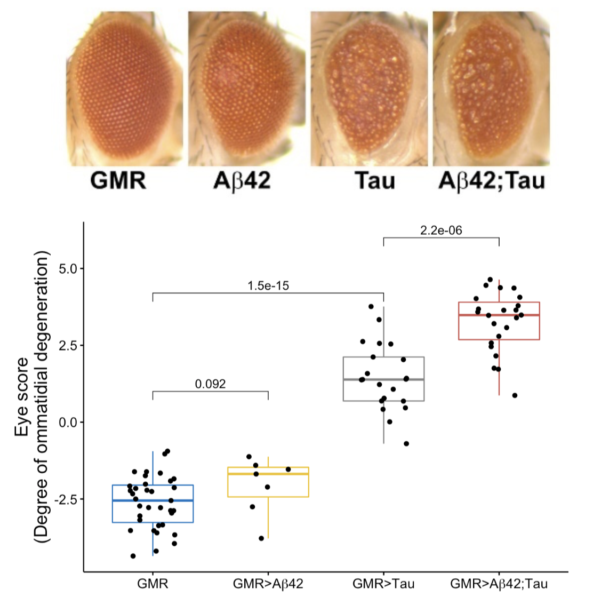

# Fly.eye.pat


**Fly.eye.pat** is an automated images analysis pipeline implemented in **R**  to score fly eye degenerative level based on ommatidia features and overall layout regularity patterns.


## Overview 

This pipeline mainly composes four steps:

1) automated ROI (region of interest) selection
2) ommatidia labeling and basic measurements
3) summerize measurements into eye features
4) perform PCA analysis on eye feature and extract PC1 as eye score




With this pipeline, it's possible to process hundreds of images within 1 hour. All intermediate plots and data can be saved for diagnostic checking.

Here is one example, I applied this pipeline to a group of images collected from four fly genotypes. They are transgenic flies generatred using the GAL4/UAS system, expressing either a driver alone (GMR), or a driver & one responder pathogenic protein gene (Abeta42, Tau), 
or drivers and two responder pathogenic protein genes (Abeta42;Tau). 

Fly eye scores output from this pipeline faithfully manifest fly eye ommatidial degeneration level, and are highly predictive of the four genotypes.



## Usage

A detailed step-by-step tutorial on this pipeline can be found [here](http://htmlpreview.github.io/?https://github.com/mingwhy/AD_fly_eye/blob/main/00_fly.eye.pat/Fly.eye.pat_step-by-step_tutorials/Fly.eye.pat_step-by-step_tutorial_1_image.html) or `Fly.eye.pat_step-by-step_tutorial_1_image.html` file in the `Fly.eye.pat_step-by-step_tutorials` folder.


A example workflow processing 6 eye images and extracting eye scores  can be found [here](http://htmlpreview.github.io/?https://github.com/mingwhy/AD_fly_eye/blob/main/00_fly.eye.pat/Fly.eye.pat_step-by-step_tutorials/Fly.eye.pat_step-by-step_tutorial_6_image.html) or `Fly.eye.pat_step-by-step_tutorial_6_image.html` file in the `Fly.eye.pat_step-by-step_tutorials` folder.

Download the two R scripts: `00_Fly.eye.pat.R` and `src_Fly.eye.pat_funcs.R`

The main script is `00_Fly.eye.pat.R`, and `src_Fly.eye.pat_funcs.R` contains supporting functions and is **sourced** inside `00_Fly.eye.pat.R`.

In `00_Fly.eye.pat.R`, 

```R
#######################################################
# source helpful R code and specify image folder path #
#######################################################
source('./src_Fly.eye.pat_funcs.R') #load helpful functions for plotting
dir.in='./eye.image.raw/' #input raw image folder 
dir.out='./eye.image.processed/' #output folder

if(!dir.exists(dir.out)){dir.create(dir.out)} #if the output folder didn't exist, create one
cat("check dir: ",dir.in,"; dirout",dir.out,"\n");

```

You could modify above code chunk to specify your input image folder path and output folder path and file name.


The final output is a txt file, you could open it in any text editor, I use ***Sublime***. 
This file contains fly eye quantitive features of each input eye image.

 

## More explanations

#### 1) automated ROI (region of interest) selection

The automated ROI seleciton algorithm was proposed and implemented by Sergio Diez-Hermano in [S Diez-Hermano, et al. 2020 ](https://www.frontiersin.org/articles/10.3389/fnins.2020.00516/full), I adapted it with minor modifications to meet the analysis needs here.

In brief, colored fly eye images are transformed into grayscale and pixels with intensity >0.99 quantile are retained.

The centroid of retained pixels is estimated and the distance of each pixel to this centroid is calculated.

Pixels whose distance to centroid are within 0.8 quantile are kept.

Then there is a second round of pixel selection, with the remaining pixels, the centroid is estimated again, and the distance of each pixel to this centroid is calculated.

Pixels whose distance to centroid are within 0.3 quantile are kept.

A 0.90 confidence level ellipse is estimated on these kept pixels and being used as final ROI selection.

***Note:*** The two rounds of pixel selection may be too loose or too stringent based on image information, it's easier to reduce this selection to one one round by setting `cutoff=c(0.8)` in the main script, or changing the quantile values `cutoff=c(0.9, 0.6)`, or increase to four rounds `cutoff = c(0.9, 0.9, 0.9, 0.9)`.


#### 2) ommatidia labelling and basic measurements

Ommatidia labelling is done through a series of functions offered by `EBImage` package in **R** and then being measured with `computeFeatures.moment` and `computeFeatures.shape` function. More detailed information about these two functions can be found [here](https://www.rdocumentation.org/packages/EBImage/versions/4.14.2/topics/computeFeatures).

There are ***8 basic measurements*** for each labelled omatidium:

- x and y coordiantes of each omatidium
- circularity of each omatidium
- area size of each omatidium
- perimeter
- mean radius
- standard deviation (sd) of the mean radius 
- max radius 
- min radium


#### 3) summerize measurements into eye features

Based on the above 8 basic measurements, **17 features** can be calcualted:

- n.omatidia: the number of ommatidia in each fly eye ROI

- nn.mean: mean of nearest neighbor distances

- nn.sd: sd of nearest neighbor distances	

- cc.mean: mean of ommatidia circularity	

- cc.sd: sd of ommatidia circularity	

- mean.s.area: mean of ommatidia area

- sd.s.area: sd of ommatidia area

- mean.s.perimeter: mean of ommatidia perimeter 

- sd.s.perimeter: sd of ommatidia perimeter 

- mean.s.radius.mean: mean of distribution of ommatidia radius mean

- sd.s.radius.mean: sd of distribution of ommatidia radius mean

- mean.s.radius.sd: mean of distribution of ommatidia radius sd

- sd.s.radius.sd: sd of distribution of ommatidia radius sd

- mean.s.radius.min: mean of distribution of minimal ommatidia radius 

- sd.s.radius.min: sd of distribution of minimal ommatidia radius 

- mean.s.radius.max: mean of distribution of maximal ommatidia radius 

- sd.s.radius.max: sd of distribution of maximal ommatidia radius 

  

***Note:*** When calcualting features for each image, only images with at least 12 labelled ommatidia would go into feature calculation procedure. For each basic measurements, when its mean or sd were used as features, the largest 3 and smallest 3 values were removed to get round extreme value influence.


#### 4) perform PCA analysis on eye feature and extract PC1 as eye score

PCA analysis was performed with R package `FactoMineR` and `factoextra`. More information about these two packages can be found [here](http://www.sthda.com/english/wiki/factoextra-r-package-easy-multivariate-data-analyses-and-elegant-visualization).

When accessing the contributions (in percentage) of each original variable to the principal components, online [documentation]( http://www.sthda.com/english/articles/31-principal-component-methods-in-r-practical-guide/112-pca-principal-component-analysis-essentials/#:~:text=The%20contribution%20of%20a%20variable,total%20cos2%20of%20the%20component) says:

> `The components of the `get_pca_var()` can be used in the plot of variables as follow:
>
> - `var$coord`: coordinates of variables to create a scatter plot
> - `var$cos2`: represents the quality of representation for variables on the factor map. It’s calculated as the squared coordinates: var.cos2 = var.coord * var.coord.
> - `var$contrib`: contains the contributions (in percentage) of the variables to the principal components. The contribution of a variable (var) to a given principal component is (in percentage) : (var.cos2 * 100) / (total cos2 of the component).

There may not be a consensus on how to estimate this contribution and functions from `FactoMineR` package offers one of the approaches and I utilized it in my pipeline.


### Have fun~
