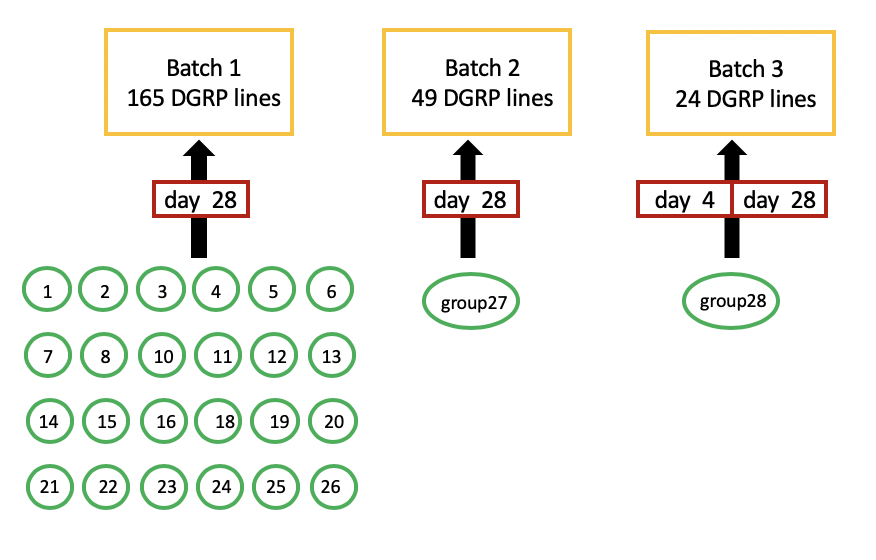

```{r setup, include=FALSE}
knitr::opts_chunk$set(echo = T,message = F,warning = F,
        fig.width=5,fig.height=5,cache = TRUE,
        #fig.show='hold',
        fig.align='center')
library(ggplot2);library(dplyr);library(purrr);library(gridExtra)
```

# Data aggregation 

## read in quantitive eye image features of the three batches into data.frames

```{r results='hide'}
#############
## batch 1 ##
#############
df1=read.table("./eye.image.processed/batch1-nn-out.txt",header = T,as.is=T);
df2=read.table(".//eye.image.processed/batch1-area-out.txt",header = T,as.is=T);
x=sapply(df1$imageID,function(x){unlist(strsplit(x,'.jpg' ))[1] })
df1$imageID=unname(x);
x=sapply(df2$imageID,function(x){unlist(strsplit(x,'.jpg' ))[1] })
df2$imageID=unname(x);

# check for imageID in the same order of df1 and df2
sum(df1$imageID==df2$imageID); 
dim(df1);dim(df2);
df=cbind(df1,df2[,-c(1,2)]);

# extract line, day, group values from imageID name (eg:group5.day28.R32.Ral_804_5.jpg)
dfa=data.frame();
for(i in 1:nrow(df)){
  name=df[i,'imageID'];
  a=unlist(strsplit(name,'\\.'));
  group=a[1];
  if(group=='Group19'){group='group19'}
  day= as.numeric(gsub("day", "", a[2],ignore.case = T));
  if(length(grep(pattern = "ral", name, ignore.case = T))==1){
    line = as.character(unlist(strsplit(name,'_')))[2];
  }else{
    if(length(grep(pattern = "441", name, ignore.case = T))==1){line=441}
    else{line=32}
  }
  if(line=='32C'){line=32
  }else if(line=='32c'){line=32
  }else if(line=='441C'){line=441
  }else if(line=='441c'){line=441}
  dfa[i,'group']=group;
  dfa[i,'line']=as.numeric(line);
  dfa[i,'day']=day;
}

# add one column variable to mark the control lines
class=rep('line',nrow(dfa));
class[dfa$line==441]='441C';
class[dfa$line==32]='32C';

par(mfrow=c(4,4),mar=c(1,1,2,1),mgp=c(0,0.3,0))
for(i in 3:ncol(df)){
  hist(df[,i],main=colnames(df)[i],cex.main=0.8,xlab='',ylab='',cex.axis=0.6)
}

# check the distribution of #ommatidia in all images
df.o=cbind(dfa,class,df); #dfa:name, class:add.1.var, df:data
(n.image=nrow(df.o))
df=df.o;
summary(df$npoint); #all images have >=20 ommatidia detected

batch1<-df;
nrow(batch1);length(unique(batch1$line))
# 3317 images from 165 lines

#############
## batch 2 ##
#############
df1=read.table("./eye.image.processed/batch2-nn-out.txt",header = T,as.is=T);
df2=read.table("./eye.image.processed/batch2-area-out.txt",header = T,as.is=T);
x=sapply(df1$imageID,function(x){unlist(strsplit(x,'.jpg' ))[1] })
df1$imageID=unname(x);
x=sapply(df2$imageID,function(x){unlist(strsplit(x,'.jpg' ))[1] })
df2$imageID=unname(x);

# check for imageID in the same order of df1 and df2
sum(df1$imageID==df2$imageID); 
sum(df1$human==df2$human);
dim(df1);dim(df2);
df=cbind(df1,df2[,-c(1,2)]);
sum(is.na(df$nn.sd))
df[is.na(df$nn.sd),]
df<-df[!is.na(df$nn.sd),]

# dfa: extract line, day, group values from imageID name(eg:group5.day28.R32.Ral_804_5.jpg)
dfa=data.frame();
for(i in 1:nrow(df)){
  name=df[i,'imageID'];
  a=unlist(strsplit(name,'\\.'));
  b=unlist(strsplit(a[1],'\\-'));
  group=b[2];
  human=b[1];
  if(length(grep("Cecilia", human))>0){human='Cecilia'}
  if(group=='Group27'){group='group27'}
  day= as.numeric(gsub("day", "", a[2],ignore.case = T));
  if(length(grep(pattern = "R32c", name, ignore.case = T))==1){
    line=32;
  }else if(length(grep(pattern = "ral", name, ignore.case = T))==1){
    line = as.character(unlist(strsplit(name,'_')))[3];
  }else if(length(grep(pattern = "R32_", name, ignore.case = T))==1){
    line=as.character(unlist(strsplit(name,'_')))[2];
  }
  dfa[i,'human']=human;
  dfa[i,'group']=group;
  dfa[i,'line']=as.numeric(line);
  dfa[i,'day']=day;
}
# add one column variable to mark the control lines
class=rep('line',nrow(dfa));
class[dfa$line==441]='441C';
class[dfa$line==32]='32C';
dfa[dfa$line==1,]
df1[dfa$line==1,]; #this image actually belongs to DGRP line 31
dfa[dfa$line==1,]$line=31

df.o=cbind(dfa,class,df); #dfa:name, class:add.1.var, df:data
df=df.o[,-1] #remove human column (images were taken by different people)
summary(df$npoint) #all images have >=20 ommatidia detected

batch2=df;
nrow(batch2); length(unique(batch2$line))
## 1309 images from 49 lines

#############
## batch 3 ##
#############
df1=read.table("./eye.image.processed/batch3-nn-out.txt",header = T,sep="\t",as.is=T);
df2=read.table("./eye.image.processed/batch3-area-out.txt",header = T,sep="\t",as.is=T);
x=sapply(df1$imageID,function(x){unlist(strsplit(x,'.jpg' ))[1] })
df1$imageID=unname(x);
x=sapply(df2$imageID,function(x){unlist(strsplit(x,'.jpg' ))[1] })
df2$imageID=unname(x);

# check for imageID in the same order of df1 and df2
sum(df1$imageID==df2$imageID); 
sum(df1$human==df2$human);
dim(df1);dim(df2);
df=cbind(df1,df2[,-c(1,2)]);

# dfa: extract line, day, group values from imageID name(eg:group5.day28.R32.Ral_804_5.jpg)
dfa=data.frame();
for(i in 1:nrow(df)){
  name=df[i,'imageID'];
  a=unlist(strsplit(name,'\\.'));
  #b=unlist(strsplit(a[1],'\\-'));
  group=a[1];
  if(group=='Group28'){group='group28'}
  if(group=='group 28'){group='group28'}
  day= as.numeric(gsub("day", "", a[2],ignore.case = T));
  
  if(length(grep(pattern='R32_R32',name,ignore.case = T))==1){
    line=32;
  }else if(length(grep(pattern = "ral", name, ignore.case = T))==1){
    line = as.character(unlist(strsplit(name,'_')))[3];
  }else if(length(grep(pattern = "R32_", name, ignore.case = T))==1){
    line=as.character(unlist(strsplit(name,'_')))[2];
  }else if(length(grep(pattern = "R32c", name, ignore.case = T))==1){
    line=32;
  }else if(grep(pattern = "R32", name, ignore.case = T)==1){
    line=32;
  }else{
    cat('error line',a[3],"\n")
  }
  if(is.na(as.numeric(line))){ cat('error line',a[3],"\n") }
  dfa[i,'group']=group;
  dfa[i,'line']=as.numeric(line);
  dfa[i,'day']=day;
}

# add one column variable to mark the control lines
class=rep('line',nrow(dfa));
class[dfa$line==441]='441C';
class[dfa$line==32]='32C';

sum(table(dfa$line))
dim(dfa)
table(dfa$line)

table(dfa$line,dfa$day) # for batch3, there are images of day4 and day28

# npoint filter, all images passed
df.o=cbind(dfa,class,df); #dfa:name, class:add.1.var, df:data
summary(df.o$npoint) #all images have >=20 ommatidia detected
batch3<-df.o;
nrow(batch3);length(unique(batch3$line))
# 997 images from 24 lines
```

## combine results of these three batches

```{r results='hide'}
###################
## begin combine ##
###################
sum(colnames(batch1)==colnames(batch2))
sum(colnames(batch1)==colnames(batch3))
batch1$batch='batch1'
batch2$batch='batch2'
batch3$batch='batch3'

cutoff=10; #discard lines in a batch if it contain less than #cutoff images
batch.before=list(batch1,batch2,batch3);
batch.after=list()
for(i in 1:length(batch.before)){
  batch=batch.before[[i]];
  length(table(batch$line)); #165 line in batch1
  sum(table(batch$line)<cutoff) 
  name=names(table(batch$line)[table(batch$line)>=cutoff])
  batch.after[[i]]<-batch[batch$line %in% name,]
}
sapply(batch.after,dim)

com.dat<-Reduce(`rbind`,batch.after)
nrow(com.dat) #5623 images in total

if(!dir.exists('./eye.image.scores')){dir.create('./eye.image.scores')}
write.table(com.dat,'./eye.image.scores/combine-3batch.txt',sep="\t",quote=F,row.names = F)
```


# Dataset summary

We performed eye imaging in three batches, different batches may involve different DGRP lines.

In batch 1, we divided DGRP lines into 24 groups and carried out eye imaging in these groups.

All imaging was done when fly is at age day 28, with exception as Batch 3, which has images from both day 4 and day28.

```{r}
com.dat=read.table("./eye.image.scores/combine-3batch.txt",header=T,as.is=T,sep="\t")
n.image=nrow(com.dat)
n.line=length(unique(com.dat$line))
n1=nrow(com.dat[com.dat$batch=='batch1',])
n2=nrow(com.dat[com.dat$batch=='batch2',])
n3=nrow(com.dat[com.dat$batch=='batch3',])
```

There are `r n.image` images of `r n.line` DGRP lines from 3 batches in total.

- `r n1` images from batch 1.
- `r n2` images from batch 2.
- `r n3` images from batch 3.

## Images dataset overview



A Venn diagram of DGRP lines in three batches is shown below.

- Batch 1 alone includes 165 DGRP lines.
- 49 DGRP lines are incluede by batch 1 and batch 2.
- 19 DGRP lines are included by all three batches.


```{r fig.width=6,fig.height=4}
## make venn plot
s1<-unique(com.dat[com.dat$batch=='batch1',]$line)
s2<-unique(com.dat[com.dat$batch=='batch2',]$line)
s3<-unique(com.dat[com.dat$batch=='batch3',]$line)

library(RVenn);
my.sets=list('batch1'=s1,'batch2'=s2,'batch3'=s3);
out = Venn(my.sets)
ggvenn(out)
```

The contribution of three batches to the number of images in each DGRP line.

```{r fig.width=16,fig.height=3}
## n.image for each line
dfa<-as_tibble(com.dat[,c(1,2,3,4,23)])
counts<- dfa %>% group_by(line,batch) %>% dplyr::summarise(n=n()) 
x1=discern(out,1,c(2,3))
x2=union(s2,s3)
#length(x1)+length(x2);
line.order=c(x1,x2)
counts$line=factor(counts$line,levels=line.order)
## absolute count
ggplot(counts,aes(x=line,y=n,fill=batch))+
  geom_bar(stat='identity')+theme_bw()+xlab("DGRP line")+ylab('number of images')+
  theme(axis.text.x=element_text(size=6,angle=45,hjust=1),
        axis.title=element_text(size=12,face="bold"))

## proportion
x<-dfa %>% group_by(line,batch) %>% dplyr::summarise(n=n()) %>%
  dplyr::mutate(freq=n/sum(n))
#x
x$line=factor(x$line,line.order)
ggplot(x,aes(x=line,y=freq,fill=batch))+
  geom_bar(stat='identity')+
  theme_bw()+xlab("DGRP line")+ylab("Proportion of images in three batches")+
  theme(axis.text.x=element_text(size=6,angle=45,hjust=1),
        axis.title=element_text(size=12,face="bold"))
```

There are 24 DGRP lines that have images from both day 4 and day 28.
(All day 4 images come from batch 3)

```{r fig.width=6,fig.height=3}
df1<-dfa;
df2<-df1[df1$line %in% unique(df1[df1$day==4,'line'])[[1]],]
df2[df2$day!=4,]$day=28;
#length(table(df2$line)) 
#24 genotypes have day4 and 28 images
# day 4 images all come from batch3
#table(df2$day,df2$batch)
x3=df2 %>% group_by(line,day) %>% 
  dplyr::summarise(n=n()) %>% dplyr::mutate(freq=n/sum(n))
#x3
x3$line=factor(x3$line,line.order)
x3$day=factor(x3$day)
ggplot(x3,aes(x=line,y=n,fill=day))+
  geom_bar(stat='identity')+
  theme_bw()+xlab("DGRP line")+ylab("count")+
  theme(axis.text.x=element_text(size=6,angle=45,hjust=1))

```

<details>
  <summary>**Image summary table**</summary>

```{r results='asis'}
dfa<-as_tibble(com.dat[,c(1,2,3,4,23)])
x<-dfa %>% group_by(line,group,day) %>% dplyr::summarise(count=n())
library(reshape2);library(pander)
counts.by.day=dcast(x,line+group~day,value.var = 'count')
counts.by.day[is.na(counts.by.day)]='';
colnames(counts.by.day)[3:6]=paste('day',c(4,27,28,29));
pander(counts.by.day)
```
</details>
\  

## save the rdata object
```{r eval=F,hide=FALSE}
com.dat=read.table("./eye.image.scores/combine-3batch.txt",header=T,as.is=T,sep="\t")
df=com.dat[,7:22] #quantitative faetures per eye image
df.info=com.dat[,c(1:6,23)] #meta information per eye image
save(df, df.info, file = "DGRP_rawUntransformed_16traits")
```

### R Session Information
```{r}
sessionInfo()
#installed.packages()[names(sessionInfo()$otherPkgs), "Version"]
```
