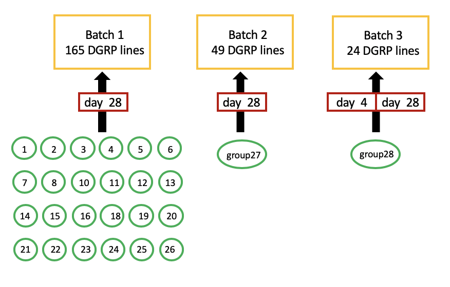
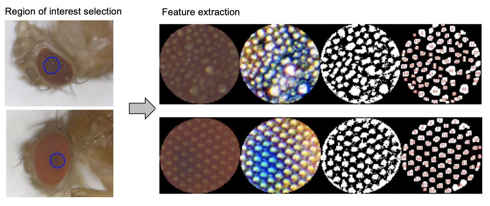

```{r setup, include=FALSE}
knitr::opts_chunk$set(echo = T,message = F,warning = F,
        fig.width=5,fig.height=5,cache = TRUE,
        #fig.show='hold',
        fig.align='center')
library(ggplot2);library(dplyr);library(purrr);library(gridExtra)
```

# Data aggregation 

## read in quantitive eye image features of the three batches into data.frames

```{r results='hide'}
#############
## batch 1 ##
#############
df1=read.table("./eye.image.processed/batch1-nn-out.txt",header = T,as.is=T);
df2=read.table(".//eye.image.processed/batch1-area-out.txt",header = T,as.is=T);
x=sapply(df1$imageID,function(x){unlist(strsplit(x,'.jpg' ))[1] })
df1$imageID=unname(x);
x=sapply(df2$imageID,function(x){unlist(strsplit(x,'.jpg' ))[1] })
df2$imageID=unname(x);

# check for imageID in the same order of df1 and df2
sum(df1$imageID==df2$imageID); 
dim(df1);dim(df2);
df=cbind(df1,df2[,-c(1,2)]);

# extract line, day, group values from imageID name (eg:group5.day28.R32.Ral_804_5.jpg)
dfa=data.frame();
for(i in 1:nrow(df)){
  name=df[i,'imageID'];
  a=unlist(strsplit(name,'\\.'));
  group=a[1];
  if(group=='Group19'){group='group19'}
  day= as.numeric(gsub("day", "", a[2],ignore.case = T));
  if(length(grep(pattern = "ral", name, ignore.case = T))==1){
    line = as.character(unlist(strsplit(name,'_')))[2];
  }else{
    if(length(grep(pattern = "441", name, ignore.case = T))==1){line=441}
    else{line=32}
  }
  if(line=='32C'){line=32
  }else if(line=='32c'){line=32
  }else if(line=='441C'){line=441
  }else if(line=='441c'){line=441}
  dfa[i,'group']=group;
  dfa[i,'line']=as.numeric(line);
  dfa[i,'day']=day;
}

# add one column variable to mark the control lines
class=rep('line',nrow(dfa));
class[dfa$line==441]='441C';
class[dfa$line==32]='32C';

par(mfrow=c(4,4),mar=c(1,1,2,1),mgp=c(0,0.3,0))
for(i in 3:ncol(df)){
  hist(df[,i],main=colnames(df)[i],cex.main=0.8,xlab='',ylab='',cex.axis=0.6)
}

# check the distribution of #ommatidia in all images
df.o=cbind(dfa,class,df); #dfa:name, class:add.1.var, df:data
(n.image=nrow(df.o))
df=df.o;
summary(df$npoint); #all images have >=20 ommatidia detected

batch1<-df;
nrow(batch1);length(unique(batch1$line))
# 3317 images from 165 lines

#############
## batch 2 ##
#############
df1=read.table("./eye.image.processed/batch2-nn-out.txt",header = T,as.is=T);
df2=read.table("./eye.image.processed/batch2-area-out.txt",header = T,as.is=T);
x=sapply(df1$imageID,function(x){unlist(strsplit(x,'.jpg' ))[1] })
df1$imageID=unname(x);
x=sapply(df2$imageID,function(x){unlist(strsplit(x,'.jpg' ))[1] })
df2$imageID=unname(x);

# check for imageID in the same order of df1 and df2
sum(df1$imageID==df2$imageID); 
sum(df1$human==df2$human);
dim(df1);dim(df2);
df=cbind(df1,df2[,-c(1,2)]);
sum(is.na(df$nn.sd))
df[is.na(df$nn.sd),]
df<-df[!is.na(df$nn.sd),]

# dfa: extract line, day, group values from imageID name(eg:group5.day28.R32.Ral_804_5.jpg)
dfa=data.frame();
for(i in 1:nrow(df)){
  name=df[i,'imageID'];
  a=unlist(strsplit(name,'\\.'));
  b=unlist(strsplit(a[1],'\\-'));
  group=b[2];
  human=b[1];
  if(length(grep("Cecilia", human))>0){human='Cecilia'}
  if(group=='Group27'){group='group27'}
  day= as.numeric(gsub("day", "", a[2],ignore.case = T));
  if(length(grep(pattern = "R32c", name, ignore.case = T))==1){
    line=32;
  }else if(length(grep(pattern = "ral", name, ignore.case = T))==1){
    line = as.character(unlist(strsplit(name,'_')))[3];
  }else if(length(grep(pattern = "R32_", name, ignore.case = T))==1){
    line=as.character(unlist(strsplit(name,'_')))[2];
  }
  dfa[i,'human']=human;
  dfa[i,'group']=group;
  dfa[i,'line']=as.numeric(line);
  dfa[i,'day']=day;
}
# add one column variable to mark the control lines
class=rep('line',nrow(dfa));
class[dfa$line==441]='441C';
class[dfa$line==32]='32C';
dfa[dfa$line==1,]
df1[dfa$line==1,]; #this image actually belongs to DGRP line 31
dfa[dfa$line==1,]$line=31

df.o=cbind(dfa,class,df); #dfa:name, class:add.1.var, df:data
df=df.o[,-1] #remove human column (images were taken by different people)
summary(df$npoint) #all images have >=20 ommatidia detected

batch2=df;
nrow(batch2); length(unique(batch2$line))
## 1309 images from 49 lines

#############
## batch 3 ##
#############
df1=read.table("./eye.image.processed/batch3-nn-out.txt",header = T,sep="\t",as.is=T);
df2=read.table("./eye.image.processed/batch3-area-out.txt",header = T,sep="\t",as.is=T);
x=sapply(df1$imageID,function(x){unlist(strsplit(x,'.jpg' ))[1] })
df1$imageID=unname(x);
x=sapply(df2$imageID,function(x){unlist(strsplit(x,'.jpg' ))[1] })
df2$imageID=unname(x);

# check for imageID in the same order of df1 and df2
sum(df1$imageID==df2$imageID); 
sum(df1$human==df2$human);
dim(df1);dim(df2);
df=cbind(df1,df2[,-c(1,2)]);

# dfa: extract line, day, group values from imageID name(eg:group5.day28.R32.Ral_804_5.jpg)
dfa=data.frame();
for(i in 1:nrow(df)){
  name=df[i,'imageID'];
  a=unlist(strsplit(name,'\\.'));
  #b=unlist(strsplit(a[1],'\\-'));
  group=a[1];
  if(group=='Group28'){group='group28'}
  if(group=='group 28'){group='group28'}
  day= as.numeric(gsub("day", "", a[2],ignore.case = T));
  
  if(length(grep(pattern='R32_R32',name,ignore.case = T))==1){
    line=32;
  }else if(length(grep(pattern = "ral", name, ignore.case = T))==1){
    line = as.character(unlist(strsplit(name,'_')))[3];
  }else if(length(grep(pattern = "R32_", name, ignore.case = T))==1){
    line=as.character(unlist(strsplit(name,'_')))[2];
  }else if(length(grep(pattern = "R32c", name, ignore.case = T))==1){
    line=32;
  }else if(grep(pattern = "R32", name, ignore.case = T)==1){
    line=32;
  }else{
    cat('error line',a[3],"\n")
  }
  if(is.na(as.numeric(line))){ cat('error line',a[3],"\n") }
  dfa[i,'group']=group;
  dfa[i,'line']=as.numeric(line);
  dfa[i,'day']=day;
}

# add one column variable to mark the control lines
class=rep('line',nrow(dfa));
class[dfa$line==441]='441C';
class[dfa$line==32]='32C';

sum(table(dfa$line))
dim(dfa)
table(dfa$line)

table(dfa$line,dfa$day) # for batch3, there are images of day4 and day28

# npoint filter, all images passed
df.o=cbind(dfa,class,df); #dfa:name, class:add.1.var, df:data
summary(df.o$npoint) #all images have >=20 ommatidia detected
batch3<-df.o;
nrow(batch3);length(unique(batch3$line))
# 997 images from 24 lines
```

## combine results of these three batches

```{r results='hide'}
###################
## begin combine ##
###################
sum(colnames(batch1)==colnames(batch2))
sum(colnames(batch1)==colnames(batch3))
batch1$batch='batch1'
batch2$batch='batch2'
batch3$batch='batch3'

cutoff=10; #discard lines in a batch if it contain less than #cutoff images
batch.before=list(batch1,batch2,batch3);
batch.after=list()
for(i in 1:length(batch.before)){
  batch=batch.before[[i]];
  length(table(batch$line)); #165 line in batch1
  sum(table(batch$line)<cutoff) 
  name=names(table(batch$line)[table(batch$line)>=cutoff])
  batch.after[[i]]<-batch[batch$line %in% name,]
}
sapply(batch.after,dim)

com.dat<-Reduce(`rbind`,batch.after)
nrow(com.dat) #5623 images in total

if(!dir.exists('./eye.image.scores')){dir.create('./eye.image.scores')}
write.table(com.dat,'./eye.image.scores/combine-3batch.txt',sep="\t",quote=F,row.names = F)
```


# Dataset summary

We performed eye imaging in three batches, different batches may involve different DGRP lines.

In batch 1, we divided DGRP lines into 24 groups and carried out eye imaging in these groups.

All imaging was done when fly is at age day 28, with exception as Batch 3, which has images from both day 4 and day28.

```{r}
com.dat=read.table("./eye.image.scores/combine-3batch.txt",header=T,as.is=T,sep="\t")
n.image=nrow(com.dat)
n.line=length(unique(com.dat$line))
n1=nrow(com.dat[com.dat$batch=='batch1',])
n2=nrow(com.dat[com.dat$batch=='batch2',])
n3=nrow(com.dat[com.dat$batch=='batch3',])
```

There are `r n.image` images of `r n.line` DGRP lines from 3 batches in total.

- `r n1` images from batch 1.
- `r n2` images from batch 2.
- `r n3` images from batch 3.

## Images dataset overview



A Venn diagram of DGRP lines in three batches is shown below.

- Batch 1 alone includes 165 DGRP lines.
- 49 DGRP lines are incluede by batch 1 and batch 2.
- 19 DGRP lines are included by all three batches.


```{r fig.width=6,fig.height=4}
## make venn plot
s1<-unique(com.dat[com.dat$batch=='batch1',]$line)
s2<-unique(com.dat[com.dat$batch=='batch2',]$line)
s3<-unique(com.dat[com.dat$batch=='batch3',]$line)

library(RVenn);
my.sets=list('batch1'=s1,'batch2'=s2,'batch3'=s3);
out = Venn(my.sets)
ggvenn(out)
```

The contribution of three batches to the number of images in each DGRP line.

```{r fig.width=16,fig.height=3}
## n.image for each line
dfa<-as_tibble(com.dat[,c(1,2,3,4,23)])
counts<- dfa %>% group_by(line,batch) %>% dplyr::summarise(n=n()) 
x1=discern(out,1,c(2,3))
x2=union(s2,s3)
#length(x1)+length(x2);
line.order=c(x1,x2)
counts$line=factor(counts$line,levels=line.order)
## absolute count
ggplot(counts,aes(x=line,y=n,fill=batch))+
  geom_bar(stat='identity')+theme_bw()+xlab("DGRP line")+ylab('number of images')+
  theme(axis.text.x=element_text(size=6,angle=45,hjust=1),
        axis.title=element_text(size=12,face="bold"))

## proportion
x<-dfa %>% group_by(line,batch) %>% dplyr::summarise(n=n()) %>%
  dplyr::mutate(freq=n/sum(n))
#x
x$line=factor(x$line,line.order)
ggplot(x,aes(x=line,y=freq,fill=batch))+
  geom_bar(stat='identity')+
  theme_bw()+xlab("DGRP line")+ylab("Proportion of images in three batches")+
  theme(axis.text.x=element_text(size=6,angle=45,hjust=1),
        axis.title=element_text(size=12,face="bold"))
```

There are 24 DGRP lines that have images from both day 4 and day 28.
(All day 4 images come from batch 3)

```{r fig.width=6,fig.height=3}
df1<-dfa;
df2<-df1[df1$line %in% unique(df1[df1$day==4,'line'])[[1]],]
df2[df2$day!=4,]$day=28;
#length(table(df2$line)) 
#24 genotypes have day4 and 28 images
# day 4 images all come from batch3
#table(df2$day,df2$batch)
x3=df2 %>% group_by(line,day) %>% 
  dplyr::summarise(n=n()) %>% dplyr::mutate(freq=n/sum(n))
#x3
x3$line=factor(x3$line,line.order)
x3$day=factor(x3$day)
ggplot(x3,aes(x=line,y=n,fill=day))+
  geom_bar(stat='identity')+
  theme_bw()+xlab("DGRP line")+ylab("count")+
  theme(axis.text.x=element_text(size=6,angle=45,hjust=1))

```

<details>
  <summary>**Image summary table**</summary>

```{r results='asis'}
dfa<-as_tibble(com.dat[,c(1,2,3,4,23)])
x<-dfa %>% group_by(line,group,day) %>% dplyr::summarise(count=n())
library(reshape2);library(pander)
counts.by.day=dcast(x,line+group~day,value.var = 'count')
counts.by.day[is.na(counts.by.day)]='';
colnames(counts.by.day)[3:6]=paste('day',c(4,27,28,29));
pander(counts.by.day)
```
</details>
\  


## Feature extraction


We designed an automated image analysis pipelineto measure ommatidial degeneration for each fly eye image using R programming language. This pipeline mainly contains four steps: 1) automated region of interest (ROI) selection. 2) image feature quantification. 3) feature selection. 4) principal component analysis on selected features. 

A step-by-step tutorial of this pipeline is shown in a separate R markdown file.



The pipeline automatically selects the region of interest(ROI) for each fly eye image and measures each ommatidium's circularity, area, perimeters, mean of radius, sd of radius, min of radius, max of radius, and ommatidia pairwise distance.

These basic measurements are summarized into 16 features.

**16 features:**

- nn.mean: mean of nearest neighbor distances
- nn.sd: sd of nearest neighbor distances	
- cc.mean: mean of ommatidia circularity	
- cc.sd: sd of ommatidia circularity	
- mean.s.area: mean of ommatidia area
- sd.s.area: sd of ommatidia area
-	mean.s.perimeter: mean of ommatidia perimeter 
- sd.s.perimeter: sd of ommatidia perimeter 
-	mean.s.radius.mean: mean of distribution of ommatidia radius mean
-	sd.s.radius.mean: sd of distribution of ommatidia radius mean
-	mean.s.radius.sd: mean of distribution of ommatidia radius sd
-	sd.s.radius.sd: sd of distribution of ommatidia radius sd
-	mean.s.radius.min: mean of distribution of minimal ommatidia radius 
-	sd.s.radius.min: sd of distribution of minimal ommatidia radius 
-	mean.s.radius.max: mean of distribution of maximal ommatidia radius 
-	sd.s.radius.max: sd of distribution of maximal ommatidia radius 


# Dataset cleaning


## Feature log-transformation

Check the distribution of the 16 features and then log-transform them.


All downstream analyses are based on log-transformed data.


Before log-transformation
```{r fig.width=8,fig.height=4}
library(stringr);library("FactoMineR");
library(gridExtra);library("factoextra")
library(tidyverse);library(reshape2);
library('ggpubr');library(pander);library("sva")

################ read in data and log-transform ##########
dat=read.table("./eye.image.scores/combine-3batch.txt",header=T,as.is=T,sep="\t")
#dim(dat); #5623 images in total

#colnames(dat)
df.info<-dat[,c(1:6,23)]
df<-dat[,7:22]

## plot raw data
par(mfrow=c(4,4),mar=c(1,1,2,1),mgp=c(0,0.3,0))
for(i in 1:ncol(df)){
  hist(df[,i],main=colnames(df)[i],cex.main=0.8,xlab='',ylab='',cex.axis=0.6)
}
```

After log-transformation
```{r fig.width=8,fig.height=4}
## plot log-transform data
df.log=apply(df,2,log);
log.names=colnames(df.log)
log.names=paste('log',log.names,sep='.')
colnames(df.log)=log.names;
par(mfrow=c(4,4),mar=c(1,1,2,1),mgp=c(0,0.3,0))
for(i in 1:ncol(df.log)){
  hist(df.log[,i],main=colnames(df.log)[i],cex.main=0.8,xlab='',ylab='',cex.axis=0.6)
}
#dim(df.log);dim(df.info)
df=df.log;
```


## Day 4 VS 28 image comparison

There are 24 DGRP lines that have images from both day 4 and day 28. 

I performed a PCA analysis on selected feature (described in the next section) for images of day 4 and day 28, then used PC1 as eye score.

```{r echo=T,fig.width=16}
# get the line names which have images on both day 4 and day 28 
# combine images of day 27 and day 29 into day 28.
name=unique(df.info[df.info$day==4,'line'])
tmp.info=df.info;
tmp.info[tmp.info$day==27 | tmp.info$day==29,]$day=28;

## select the 9 variables
keep=c('log.nn.sd','log.cc.mean','log.sd.s.area',
       'log.mean.s.perimeter','log.sd.s.radius.mean', 
       'log.mean.s.radius.sd','log.sd.s.radius.sd',
       'log.sd.s.radius.min','log.mean.s.radius.max');

#dim(df);dim(tmp.info)
#sum(tmp.info$line %in% name)

data<-df[tmp.info$line %in% name,keep]
data.info=tmp.info[tmp.info$line %in% name,]
#dim(data);dim(data.info)


saveRDS(list(data,data.info),'./eye.image.scores/batch_day4_28.rds');

data2=scale(data,center=T,scale = T)
#apply(data,2,mean);apply(data,2,sd)
df.pca<-PCA(data2,graph=F,ncp = 10)
eig.val <- get_eigenvalue(df.pca); eig.val; #get eigenvalues
#eig.val
#plot variance.percent
fviz_eig(df.pca, addlabels = TRUE,main='',xlab="PC"); 

# check each variable contribution to PCs
var<-get_pca_var(df.pca)
#var$contrib
fviz_pca_var(df.pca, col.var = "contrib",
               gradient.cols = c("#00AFBB", "#E7B800", "#FC4E07"), 
               repel = TRUE) # Avoid text overlapping


#use PC1 as eye score
df.score<-cbind(data.info,df.pca$ind$coord[,1])
colnames(df.score)[8]='score'
#colnames(df.score)
#head(df.score)

#ggplot(df.score,aes(x=factor(line),y=score,col=factor(day)))+geom_boxplot()+geom_jitter()+theme_bw()

score.order=levels(with(subset(df.score,day==4),reorder(line,score,FUN = median)))
df.score$line=factor(df.score$line,levels = score.order)
df.score$day=factor(df.score$day)
ggplot(df.score,aes(x=line,y=score,col=day))+
  ylab('Eye score\n(Degree of ommatidial degeneration)')+
  xlab("DGRP lines")+
  geom_boxplot(outlier.shape = NA,lwd=1)+
  geom_jitter(size=0.4,position = position_jitterdodge())+
  theme_bw(base_size = 19)+
  theme(panel.grid=element_blank(),
        axis.text=element_text(size=16),
          legend.position = "top", 
        legend.text = element_text(size = 16),
        legend.title = element_text(size = 16),
        legend.key.size = unit(1, "cm"),)+
  scale_color_manual(values=c("#00AFBB", "#E69F00"))+
  stat_compare_means(aes(group = day), #label = "p.format")
                     label = "p.signif",size=8)

## remove R32
ggplot(subset(df.score,line!=32),aes(x=line,y=score,col=day))+
  ylab('Eye score\n(Degree of ommatidial degeneration)')+
  xlab("DGRP lines")+
  geom_boxplot(outlier.shape = NA,lwd=1)+
  geom_jitter(size=0.4,position = position_jitterdodge())+
  theme_bw(base_size = 19)+
  theme(panel.grid=element_blank(),
        axis.text=element_text(size=16),
          #legend.position = "top", 
        legend.text = element_text(size = 16),
        legend.title = element_text(size = 16),
        legend.key.size = unit(1, "cm"),)+
  scale_color_manual(values=c("#00AFBB", "#E69F00"))+
  stat_compare_means(aes(group = day), #label = "p.format")
                     label = "p.signif",size=8) #+ggtitle('R32 removed')


out<-compare_means(score ~ day, data = df.score, 
              group.by = "line", paired = F)
out
tmp=df.score %>% group_by(line,day) %>% summarise(eye.score.median=median(score))
tmp1=dcast(tmp,line ~ day)
tmp2=merge(out,tmp1,by='line')
tmp2=tmp2[,c(1,10,11,5:9)]
write.table(tmp2,'./eye.image.scores/compare-day4-day28.txt',sep="\t",quote=F,row.names = F)
```

```{r echo=T,fig.width=8,fig.height=6}
## R32 line alone
ggplot(subset(df.score,line==32),aes(x=line,y=score,col=day))+
  ylab('Eye score\n(Degree of ommatidial degeneration)')+
  xlab('')+
  
  #xlab("GMR>Ab42;tau")+
  geom_boxplot(outlier.shape = NA,lwd=1)+
  geom_jitter(size=1.5,position = position_jitterdodge())+
  theme_bw(base_size = 18)+
  #ggtitle('R32 line')+
  theme(panel.grid=element_blank(),
        axis.text=element_blank(),
        axis.ticks = element_blank(),
        legend.position = "top", 
        legend.text = element_text(size = 16),
        legend.title = element_text(size = 16),
        legend.key.size = unit(1, "cm"), )+
  scale_color_manual(values=c("#00AFBB", "#E69F00"))+
  stat_compare_means(aes(group = day), size=12,
                     show.legend = FALSE,#label = "p.format")
                     label = "p.signif")

```

compute eye score variance for these DGRP line at young and old ages.


```{r echo=T,fig.width=9}
df.var<-df.score %>% group_by(line,day) %>% summarise(var=var(score))
df.var$line=as.character(df.var$line)
df.var[df.var$line=='32',]$line='R32';
x<-t.test(df.var[df.var$day==4,]$var,
       df.var[df.var$day==28,]$var,
       paired = TRUE)
print(x)
ggplot(df.var,aes(x=factor(day),y=var,group=factor(line),col=factor(line)))+
  geom_line()+theme_bw(base_size=20)+
  scale_color_discrete(name='DGRP lines')+
  ylab('variance of eye scores per DGRP line')+xlab('Day')+
  theme(axis.text=element_text(size=24))+
  ggtitle(paste0('Paired sample t-test\npvalue=',round(x$p.value,6)))

```


**In the following analyses, images of day 4 are discarded, `r n.image` images of `r n.line` DGRP lines remain in the dataset.**


```{r results='hide'}
## remove day4 and combine day27, day29 into day28
## from now on, work with df = df.log
table(df.info$day)

df=as.data.frame(df.log[df.info$day!=4,])
df.info=as.data.frame(df.info[df.info$day!=4,])
str(df)
str(df.info)

table(df.info$day)
df.info$day=28
dim(df.info); # 5436 images
id<-str_match(df.info$group, '\\d+') 
table(id)
id=as.numeric(id)
df.info$group.id<-id
dim(df.info);dim(df);
n.image=nrow(df.info)
n.line=length(unique(df.info$line))
```


## Group effect removal for batch 1

There are `r sum(df.info$batch=='batch1')` images of 165 DGRP lines from batch 1.


For each of the 16 features, build linear model `lm(feature ~ line + group)` and use `ANOVA` to partition variance explained by DGRP line and by group.

```{r fig.width=6,fig.height=4}
## as batch 1 contain 24 groups and all lines 
## check for group effect in batch1 first
df.batch1=df[df.info$batch=='batch1',]
#dim(df.batch1); #3453 images,  16

## plot each feature ~ group boxplot
df.batch1.info<-df.info[df.info$batch=='batch1',]
df.batch1.info$group=factor(df.batch1.info$group)
df.batch1.info$line=factor(df.batch1.info$line)

batch.var<-function(score.df,info.df){
  out=as.numeric();
  info.df$group=factor(info.df$group)
  info.df$line=factor(info.df$line)
  for(i in 1:ncol(score.df)){
    score<-score.df[,i]
    info.df$score=score;
    #boxplot(log(df.info$score)~df.info$group.id,xlab='group',ylab='log(score)')
    
    mod1=lm(score~line,data=info.df);
    #summary(mod1);
    r1=anova(mod1)
    (x1=sprintf("%.6f",r1$`Sum Sq`[[1]]/sum(r1$`Sum Sq`)));
    
    mod2=lm(score~group,data=info.df); #potential batch effect
    #summary(mod2); 
    r2=anova(mod2);
    (x2=sprintf("%.6f",r2$`Sum Sq`[[1]]/sum(r2$`Sum Sq`)))
    
    mod3=lm(score~line+group, data=info.df); 
    #summary(mod3); 
    r3=anova(mod3);
    (x3=sprintf("%.6f",(r3$`Sum Sq`[[1]]+r3$`Sum Sq`[[2]])/sum(r3$`Sum Sq`)));
    x1=sprintf("%.6f",r3$`Sum Sq`[[1]]/sum(r3$`Sum Sq`));
    x2=sprintf("%.6f",r3$`Sum Sq`[[2]]/sum(r3$`Sum Sq`));
    out=rbind(out,c(i,x1,x2,x3));
  }
  out=as.data.frame(matrix(as.numeric(out),ncol=4));
  out=cbind(out,out[,3]/out[,2])
  colnames(out)=c('stat','var.by.line','var.by.group','total.var.explained','ratio')
  return(out)
}
out1=batch.var(df.batch1,df.batch1.info)
#out1$ratio
head(out1)
tmp1<-out1[,c(1,2,3)];
tmp1$stat<-colnames(df.batch1)
tmp1$condition<-'before'
tmp<-melt(tmp1,id.vars = c("stat",'condition'));

ggplot(tmp,aes(x=stat,fill=variable,y=value))+
  geom_bar(stat='identity')+
  xlab("feature")+ylab("var.prop")+theme_bw()+
    theme(axis.text.x=element_text(size=7,angle=45,hjust=1),
          legend.title=element_text(size=10,face="bold"),)
```

Use `R-package sva` to remove group effect and then recheck the variance partition.

```{r fig.width=14,fig.height=5}
## Remove batch effect with 'sva' package 
batch=as.factor(df.batch1.info$group);
pheno=data.frame(df.batch1.info$group,df.batch1.info$line);
pheno$sample=seq(1,nrow(df.batch1.info),1)
rownames(pheno)=df.batch1.info$imageID
modcombat = model.matrix(~1, data=pheno)

edata=t(df.batch1); #df: sample by feature. t(df):feature by sample
colnames(edata)=df.batch1.info$imageID;
combat_edata = ComBat(dat=edata, batch=batch, mod=modcombat, 
                      par.prior=TRUE, prior.plots=F, mean.only=TRUE)

#sum(colnames(combat_edata)==df.batch1.info$imageID);

df.batch1.after=data.frame(t(combat_edata));
#dim(df.batch1.after);dim(df.batch1.info)

out2=batch.var(df.batch1.after,df.batch1.info)
#which(out2$ratio>0.1);#1  3  4 13 14

tmp1<-out1[,c(1,2,3)];
tmp1$stat<-colnames(df.batch1)
tmp1$condition<-'before'

tmp2<-out2[,c(1,2,3)];
tmp2$stat<-colnames(df.batch1)
tmp2$condition<-'after'
tmp3<-rbind(tmp1,tmp2)
tmp<-melt(tmp3,id.vars = c("stat",'condition'));
#tmp<-melt(tmp1,id.vars = c("stat",'condition'));
ggplot(tmp,aes(x=stat,fill=variable,y=value))+
  geom_bar(stat='identity')+facet_wrap(.~condition)+
  xlab("feature")+ylab("var.prop")+theme_bw()+
    theme(axis.text.x=element_text(size=6,angle=45,hjust=1))

#which(out2$var.by.group>0.05)
rm.features=colnames(df.batch1)[which(out2$var.by.group>0.05)]
```

There are 2 features (`r rm.features`) whose explained.variance>0.05 after group effect removal.


These 2 features will be removed in the next step 'feature selection'.

# Feature selection and batch effect removal
```{r results='hide'}
###################################################
## update df and df.info, substitue df.batch1.after
x<-df[df.info$batch!='batch1',]
dim(x)
dim(df.batch1.after)
x<-rbind(df.batch1.after,x)
dim(x)
df<-x
dim(df);dim(df.info)
```

## feature selection

As "ground truth", `line 441` is our reference line, representing normal fly eye in face of Ab/Tau transgene.

I used the 3317 images of 165 DGRP lines from batch 1 to plot feature distributions.

If one feature fails to rank `line 441` as one of the extreme, this feature is thrown away.

```{r echo=T,fig.height= 20,fig.width=32}
##################################
### feature selection ######
# have a look of distribution of all variables.
df.batch1=df[df.info$batch=='batch1',]

(vars=colnames(df.batch1))
plot.box<-function(input,name=name){
  # p1=ggplot(df,aes(x=reorder(aes_string(paste(var)),FUN = median),y=aes_string(paste(var)),col=factor(class)))
  p1=ggplot(input,aes(x=reorder(line,var,FUN = median),y=var,col=class,fill=class))
  p1+geom_boxplot(outlier.shape=NA,outlier.size=0,lwd=0.4)+
    #scale_colour_manual(name='',labels=c('R32','441','DGRP lines'),values=c("#E69F00", "#009E73","#999999"))+
    #scale_colour_manual(name='',labels=c('R32','441','DGRP lines'),values=c("#0072B2", "#FC4E07","#C0C0C0"))+
    scale_colour_manual(name='',labels=c('R32','WT','DGRP lines'),values=c("#E69F00", "#009E73","#999999"))+
  scale_fill_manual(name='',labels=c('R32','WT','DGRP lines'),values=c("#E69F007F", "#009E737F" ,"#F0F8FF7F" ))+
    #p1+geom_boxplot(outlier.shape = NA)+
    #geom_jitter()+
    xlab("DGRP lines")+ylab(name)+theme_bw(base_size = 20)+
    theme(legend.position="top",
          panel.grid.major = element_blank(),
          panel.grid.minor = element_blank(),
          panel.background = element_blank(),
          axis.text.x=element_blank(),
          axis.ticks = element_blank(),
          #axis.text=element_text(size=6,angle=45,vjust=0.5),
          axis.title=element_text(size=20,face="bold"))
}

## check if 441 has outliers
all=as.character();
tmp=df.batch1[df.batch1.info$line==441,];
for(i in vars){
  var=tmp[[i]];
  outlier = names(boxplot(var, plot=FALSE)$out);
  cat("i=",i,", ",outlier,"\n");
  all=c(all,outlier);
} 

(max.n<-length(unique(df.batch1.info$line)))
plots=list();
out=as.numeric();
for(i in 1:length(vars)){
  var=df.batch1[[vars[i]]];
  tmp2=cbind(df.batch1.info, var);
  tmp2$var=as.numeric(tmp2$var);
  # print out lowest and highest rank DGRP line name
  x=levels(with(tmp2,reorder(line,var,FUN=median)))[c(1,max.n)]
  cat("i=",i,",",x,"\n");
  plots[[i]]<-plot.box(input=tmp2,name=vars[i])+theme(legend.position="none");
  out=rbind(out,c(i,x))
}
do.call("grid.arrange", c(plots, ncol=4))

## based on the 16 distribution plots, 
## remove 7 variables which do not rank 441 as the 'extreme' (the normal eye). 
## Then perform PCA analysis with the retaining 9 variable and extract PC**
sum(out[,2]==441);sum(out[,3]==441)

(rm.i=which(out[,2]!=441)) #indluding 4 and 13!!!!
(i=which(out[,2]==441)) 
sel=colnames(df.batch1)[i]

## highlight selected variables
plots=list();
for(i in 1:length(vars)){
  var=df.batch1[[vars[i]]];
  tmp2=cbind(df.batch1.info, var);
  tmp2$var=as.numeric(tmp2$var);
  # print out lowest and highest rank DGRP line name
  x=levels(with(tmp2,reorder(line,var,FUN=median)))[c(1,max.n)]
  cat("i=",i,",",x,"\n");
  if(sum(vars[i] %in% sel)>0){
    plots[[i]]<-plot.box(input=tmp2,name=vars[i])+
      theme(axis.title.y=element_text(color='#D16103'),
                                     legend.position="top");
  }else{
    plots[[i]]<-plot.box(input=tmp2,name=vars[i])+theme(legend.position="top");
  }
}

do.call("grid.arrange", c(plots, ncol=4))

rm('tmp2')
plots=list();
for(i in 1:length(sel)){
  var=df.batch1[[sel[i]]];
  tmp2=cbind(df.batch1.info, var);
  tmp2$var=as.numeric(tmp2$var);
  # print out lowest and highest rank DGRP line name
  x=levels(with(tmp2,reorder(line,var,FUN=median)))[c(1,max.n)]
  cat("i=",i,",",x,"\n");
  plots[[i]]<-plot.box(input=tmp2,name=vars[i]);
}
# plot the selected 9 feature
do.call("grid.arrange", c(plots, ncol=3))
#for(i in plots){print(i)}
```

Out of the 16 features, 7 features fail to rank `line 441` as extreme. Throw them away.

The selected 9 features are: `r sel`.

```{r results='hide'}
########################################
## filter feature and update data frame
df.keep=df[,-rm.i];
colnames(df.keep)
#table(df.info$line)

df.before.keep=df;
df=df.keep
dim(df.info);dim(df)
```

## batch effect removal 

Before combining images from all three batches to rank DGRP lines, use `R-pacakge sva` to remove batch effect.

```{r fig.width=14,fig.height=5}
###############################################################
## Remove batch effect for all 3 batches with 'sva' package 
tmp.info<-df.info
tmp.info$group=factor(tmp.info$batch);
out1=batch.var(df,tmp.info)
# barplot, show var partition

batch=as.factor(df.info$batch);
pheno=data.frame(df.info$line,df.info$batch);
pheno$sample=seq(1,nrow(df.info),1)
rownames(pheno)=df.info$imageID
modcombat = model.matrix(~1, data=pheno)

edata=t(df); #df: sample by feature. t(df):feature by sample
colnames(edata)=df.info$imageID;
combat_edata = ComBat(dat=edata, batch=batch, mod=modcombat, 
         par.prior=TRUE, prior.plots=F, mean.only=TRUE)

#sum(colnames(combat_edata)==df.info$imageID);

df.after=data.frame(t(combat_edata));
#dim(df.after);dim(df.info)

tmp.info<-df.info
tmp.info$group=tmp.info$batch;
out2=batch.var(df.after,tmp.info)


tmp1<-out1[,c(1,2,3)];
tmp1$stat<-colnames(df.after)
tmp1$condition<-'before'

tmp2<-out2[,c(1,2,3)];
tmp2$stat<-colnames(df.after)
tmp2$condition<-'after'
tmp3<-rbind(tmp1,tmp2)
tmp<-melt(tmp3,id.vars = c("stat",'condition'));
#tmp<-melt(tmp1,id.vars = c("stat",'condition'));
ggplot(tmp,aes(x=stat,fill=variable,y=value))+
  geom_bar(stat='identity')+facet_wrap(.~condition)+
  xlab("feature")+ylab("var.prop")+theme_bw()+
  scale_fill_discrete(name = "variable", 
                      labels = c("var.by.line","var.by.batch"))+
  theme(axis.text.x=element_text(size=7,angle=45,hjust=1),
        legend.title=element_text(size=10,face="bold"))
```


# Rank DGRP lines in terms of eye score

## Perform PCA analysis on image by feature matrix 

As there are 9 features for each image, to summarize them into one final fly eye score, I performed PCA on `r nrow(df.info)` images from all three batches.

```{r echo=T,fig.width=5,fig.height=4}
################################################################
# PCA using spectral decomposition in R
# compuate correlation matrix and its eigenvalues, eigenvectors.
data=df.after;
df.pca <- PCA(data, graph = FALSE,ncp=10); #'FactoMineR' package
eig.val <- get_eigenvalue(df.pca); eig.val; #get eigenvalues
fviz_eig(df.pca, addlabels = TRUE,main='',xlab="PC"); #plot variance.percent
```

Contribution of each feature to PC components

```{r fig.height=4, fig.width = 5}
fviz_pca_var(df.pca, col.var = "contrib",
gradient.cols = c("#00AFBB", "#E7B800", "#FC4E07"), 
repel = TRUE # Avoid text overlapping
)
```


## Eye score distribution in DGRP lines 

**Use PC1 as eye sore for each image and rank DGRP lines with images from all three batches.**

```{r fig.width=7,fig.height=4.5}
df.score<-data.frame(score=df.pca$ind$coord[,1],df.info$line,df.info$class)
write.table(df.score,'./eye.image.scores/eye.score_for_each.image.txt',sep='\t',row.names = T,quote=F)
#df.score<-data.frame(score=
#  apply(df.pca$ind$coord[,1:2],1,sum),df.info$line,df.info$class)
df.score=df.score[df.score$df.info.line!=43,]; #line_43 has some mislabelling problem, remove it from following analysis.
colnames(df.score)=c('score','line','class');
```


```{r fig.width=10,fig.height=4.5}
#name='score(sum of PC1,2,3)';
name='score(PC1)';

p1=ggplot(df.score,aes(x=reorder(line,score,FUN = median),y=score,col=class,fill=class))
p2<-p1+geom_boxplot(outlier.shape=NA,outlier.size=0,lwd=0.3)+theme_bw()+
  #p1+geom_boxplot(outlier.shape = NA)+
  scale_colour_manual(name='',labels=c('R32','WT','DGRP lines'),values=c("#E69F00", "#009E73","#999999"))+
  scale_fill_manual(name='',labels=c('R32','WT','DGRP lines'),values=c("#E69F007F", "#009E737F" ,"#F0F8FF7F" ))+
  #scale_colour_manual(name='',labels=c('R32','WT','DGRP lines'),values=c("#0072B2", "#FC4E07","#C0C0C0"))+
  #geom_jitter()+
  xlab("DGRP lines")+ylab('Eye score\n(Degree of ommatidial degeneration)')+
  theme(#legend.position="none",
        panel.grid.major = element_blank(),
        panel.grid.minor = element_blank(),
        #panel.border = element_blank(),
        panel.background = element_blank(),
        axis.text.x=element_blank(),
        axis.ticks.x=element_blank(), #legend.position = "top",
        legend.text = element_text(size = 12),
        legend.title = element_text(size = 12),
        legend.key.size = unit(0.6, "cm"),
        axis.text=element_text(size=14,angle=0,vjust=0.5),
        axis.title=element_text(size=14))
        #axis.title=element_text(size=14,face="bold"))
p2;

## remove R32 and plot
p1=ggplot(subset(df.score,line!=32),aes(x=reorder(line,score,FUN = median),y=score,col=class))
p2<-p1+geom_boxplot(outlier.shape=NA,outlier.size=0,lwd=0.4)+theme_bw()+
  #p1+geom_boxplot(outlier.shape = NA)+
  #scale_colour_manual(values=c("#E69F00", "#009E73","#999999"))+
  scale_colour_manual(name='',labels=c('WT','DGRP lines'),values=c("#009E73","#999999"))+
  #scale_colour_manual(name='',labels=c('WT','DGRP lines'),values=c("#FC4E07","#C0C0C0"))+
  #geom_jitter()+
  xlab("DGRP lines")+ylab('Eye score\n(Degree of ommatidial degeneration)')+
  theme(#legend.position="none",
        panel.grid.major = element_blank(),
        panel.grid.minor = element_blank(),
        #panel.border = element_blank(),
        panel.background = element_blank(),
        axis.text.x=element_blank(),
        axis.ticks.x=element_blank(),
        axis.text=element_text(size=12,angle=0,vjust=0.5),
        axis.title=element_text(size=12,face="bold"))
p2+geom_text(x=100, y=10,label='p.value < 2e-16',col='black')

#p2+stat_compare_means(method = "anova",label.x=60,label.y=10,label = "p.format",size=6)
score.order=levels(with(df.score,reorder(line,score,FUN = median)))
#which(score.order=='32')-1-1 ##how many lines are better than R32 (except 441)
#length(score.order)-which(score.order=='32') #how many lines are worse than R32

df.score$line=factor(df.score$line)
x=lm(score~line, data=df.score); 
#print( summary(x) ); 
r=anova(x);
print( r )
rp=sprintf("%.6f",r$`Sum Sq`[[1]]/sum(r$`Sum Sq`))
percent <- function(x, digits = 2, format = "f", ...) {
  paste0(formatC(100 * x, format = format, digits = digits, ...), "%")
}
rp=percent(r$`Sum Sq`[[1]]/sum(r$`Sum Sq`))

pVal <- r$'Pr(>F)'[1]

```

- There are `r length(score.order)` genotypes in total, 162 of them are progenies of DGRP X R32, 1 control line as WT, 1 control line as R32.

- There are `r which(score.order=='32')-1-1` lines which  ranked as having equal or better eye integrity than R32 (WT 441 control excluded).

- There are `r length(score.order)-which(score.order=='32') ` lines which  ranked as having worse eye integrity than R32.

- `ANOVA` on linear model `lm(eye.score ~ line)` indicates that DGRP line could explain `r rp` of total eye score variance.


**Ranking DGRP lines with eye score with images from all three batches**
```{r}
############# ranking lines
## From WT eye to messed-up
df.score$line=factor(df.score$line)
byx=df.score %>% group_by(line) %>% 
  dplyr::summarise(n = n(),median = median(score))

#x=byx[rev(order(byx$median)),]
x=byx[(order(byx$median)),]
#x=as.character(byx[order(byx$median),]$line);
#x=(rev(x)); names(x)=seq(1,length(x),1)
out=data.frame(rank=seq(1,nrow(x),1),line=x$line,"number.of.images"=x$n,'eye.score'=x$median)
out

out$rank=seq(1,nrow(out),1);
write.table(out,'./eye.image.scores/eye.score_for_DGRP.lines_all.three.batches.txt',sep='\t',row.names = F,quote=F)
```

### R Session Information
```{r}
sessionInfo()
#installed.packages()[names(sessionInfo()$otherPkgs), "Version"]
```
