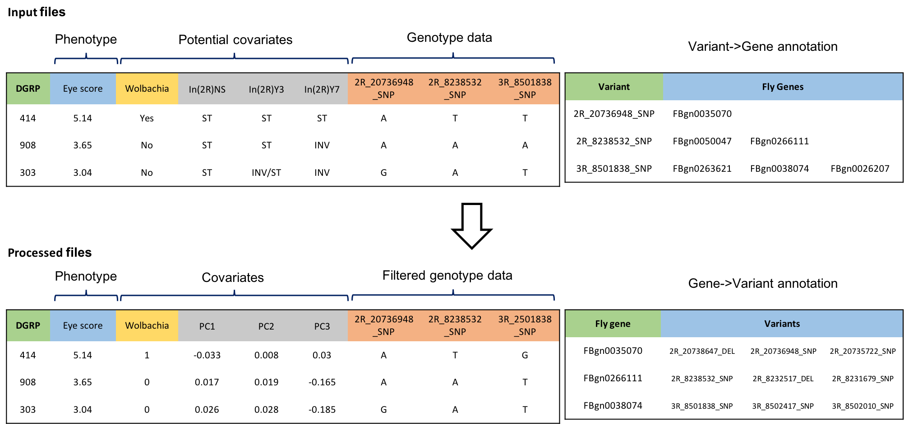

```{r setup, include=FALSE}
knitr::opts_chunk$set(echo = T,message = F,warning = F,
        fig.width=6,fig.height=4,cache = TRUE,
        #fig.show='hold',
        fig.align='center')
knitr::opts_knit$set(root.dir = getwd())
library(reshape2)
library(RVenn)
library(ggrepel)
library("biomaRt")
library(gplots)
library(knitr)
library(tidyverse)
library(readxl)
library("scatterplot3d") 
library(pander)
library(qqman)
library(clusterProfiler)
library(AnnotationDbi)
library(org.Dm.eg.db,verbose=F,quietly=T)
library(ggpubr)
```

In this markdown file, I will use PLINK (v1.9) to perform genome-wide association (GWAS) analysis to associate genetic variants with AD fly eye phenotype data in DGRP lines, and further employ a permutation procedure to identify a candidate set of fly genes which serve as potential modifier genes.


# Preparing files

## Eye phenotype data and covariates files

- **eye phenotype data**: eye score for 162 DGRP lines (filename:eye.score_for_DGRP.lines_all.three.batches.txt, generated from `01_get.eye.score`)

- covariates
  - **Inverstion status**: downloaded from http://dgrp2.gnets.ncsu.edu/data/website/inversion.xlsx
  - **Wolbachia infection status**: downloaded from http://dgrp2.gnets.ncsu.edu/data/website/wolbachia.xlsx


```{r results='hide'}
## eye phenotype data
eye<-read.table("../01_get.eye.score/eye.image.scores/eye.score_for_DGRP.lines_all.three.batches.txt",as.is=T,header=T)
eye<-as_tibble(eye)
head(eye)

eye$eye.score=-eye$eye.score # now wild-type 441 line has the highest eye score
eye<-tibble('L'=as.character(eye$line),'y'=eye$eye.score)

## inverstion status
inv <- read_excel("./GWAS.analysis/dgrp2/inversion.xlsx",sheet = 1, col_names = TRUE)
head(inv)
dim(inv) #205 line X 16 inversions, 1 col = DGRP line
colnames(inv)

inv$`DGRP Line` <- gsub("DGRP_", "", inv$`DGRP Line`, fixed=TRUE)
invcols <- colnames(inv)    
invcols[1] <- "L"
colnames(inv) <- invcols
inv<-as_tibble(inv);

## wolbachia infection status
wo <- read_excel("./GWAS.analysis/dgrp2/wolbachia.xlsx",sheet = 1, col_names = TRUE)
dim(wo) #205line
colnames(wo) <- c("L", "wo")
wo$L <- gsub("DGRP__", "", wo$L, fixed=TRUE)
table(wo[,-1])
wo1<-apply(wo,2,function(x){
  x<-gsub('n',0,x)
  x<-gsub('y',1,x)
  as.numeric(x)
})
dim(wo1);dim(wo)
colnames(wo1)
wo<-as_tibble(wo);
wo1<-as_tibble(wo1);

## combine eye.score, inversion, wolbachia infection data in one data.frame
inv$L=as.character(inv$L)
wo$L=as.character(wo$L)

eyeInv <- left_join(eye, inv, by= "L")
dim(eyeInv)
colnames(eyeInv)

eyeIW <- left_join(eyeInv, wo, by="L")
dim(eyeIW) 
# there is no information regarding inversion status or wolbachia infection for line 43
# I delete this line before GWAS analysis

eyeIW=eyeIW[eyeIW$L!=441 & eyeIW$L!=32,] # 441 and 32 are the two control lines
write.table(eyeIW,file='./GWAS.analysis/input_files/eye-inv-wo.txt',quote=F,row.names = F,sep="\t")

line=paste('line',eyeIW$L,sep='_')
eye.score<-cbind(line,line,eyeIW$y)
dim(eye.score) # 162   3
colnames(eye.score)=c('FID','IID','score')
write.table(eye.score,file='./GWAS.analysis/input_files/eye-pheno.txt',quote=F,row.names = F,sep="\t")

```

Have a look at eye.score, inversion status,  wolbachia infection status distribution among these 162 DGRP lines.

```{r fig.width=16}
par(mar=c(5,4,2,1),mfrow=c(1,2))
hist(eye$y,breaks=20,xlab='eye score',main='')
barplot(table(eyeIW$wo),xlab='Wolbachia status',ylab='#DGRP lines')

x=as.numeric();
for(i in 3:18){
  x=cbind(x,c(sum(eyeIW[,i]=='INV'),sum(eyeIW[,i]=='INV/ST'),sum(eyeIW[,i]=='ST')));
}
colnames(x)<-colnames(eyeIW[,3:18])
rownames(x)<-c('INV','INV/ST','ST')
x1<-melt(x)
colnames(x1)=c('inversion.status','inv','value');
ggplot(x1,aes(x=inv,y=value,fill=inversion.status))+geom_bar(stat='identity')+theme_bw(base_size = 12)+theme(axis.text.x=element_text(size=10,angle=45,hjust=1))+xlab('Inversion')+ylab('Percentage of DGRP lines')
```

**Table: eye score and covariates for DGRP lines**

```{r}
#knitr::kable(eyeIW)
eyeIW
```


## DGRP genotype data files


I firsted downloaded genotype data of 205 DGRP lines from 
Online database [dgrp2](http://dgrp2.gnets.ncsu.edu/data.html):

http://dgrp2.gnets.ncsu.edu/data.html --> Genotype files: --> 2.Plink formatted genotype (BED/BIM/FAM)


I extracted genotype data of the **162 DGRP lines** with eye scores, and filtered out genetic variants whose **minor allele frequency < 0.05 or genotype call rate < 0.8**.


```{r class.source = 'fold-show',eval=F}
# bash commands, do not run in R
# extracting 162 genotype data from dgrp2 downloaded files
# dgrp2.bed, dgrp2.bim, dgrp2.fam files were downloaded from dgrp2 database 
# and saved in a folder named 'dgrp2'
$ cd GWAS.analysis/dgrp2/;
$ cut -f1 ../input_files/eye-pheno.txt | sed '1d' >retain.DGRPlines 

# generate dgrp2-162lines.bim, dgrp2-162lines.bed, dgrp2-162lines.fam files.
$ plink --bfile ./dgrp2 --keep-fam retain.DGRPlines --make-bed --out dgrp2-162lines

$ wc -l *fam
     162 dgrp2-162lines.fam
     162 dgrp2-162lines.maf0.05.fam
     205 dgrp2.fam

# calculate allele freq and count missingness: 
# plink.lmiss, plink.imiss, plink.frq files are generated.
$ plink --bfile ./dgrp2-162lines --freq --missing
```


```{r fig.width=16}
par(mfrow=c(1,2))
#call=read.table("./GWAS.analysis/dgrp2/plink.lmiss",header=T,as.is=T)
#saveRDS(call,'./GWAS.analysis/dgrp2/plink.lmiss.rds')
call=readRDS('./GWAS.analysis/dgrp2/plink.lmiss.rds')
call$rate=1-call$F_MISS

x<-quantile(call$rate,probs=seq(0,1,0.0001))
plot(seq(0,1,0.0001),x,xlab='Quantile',ylab='Genotype call rate',
     main='Genotype call rate.\nThe red horizontal line represents the 0.8 SNP call rate');
abline(h=0.8,col='red',lwd=2)

maf=read.table("./GWAS.analysis/dgrp2/plink.frq",header=T,as.is=T)
hist(maf$MAF,xlab='MAF',main='Minor allele frequency (MAF).\nThe red verticalline represents MAF=0.05')
abline(v=0.05,col='red',lwd=2)
rm(maf);rm(call);
```


## Genetic variants annotation files

The gene annotation of genetic variants in fly is downloaded from:

http://dgrp2.gnets.ncsu.edu/data.html --> Other useful files --> 4.[Variant annotation](http://dgrp2.gnets.ncsu.edu/data/website/dgrp.fb557.annot.txt) (based on FB5.57)

- There are four types of variants: DEL, INS, MNP and SNP.
- Most variants are only annotated to one gene, there are 62 variants annotated to 11 genes and 19 variants annotated to 12 genes.
- In summary, there are 3516713 variants annotated to 16745 genes.

```{r class.source = 'fold-show',eval=F}
# bash commands, do not run in R
# download variants annotation file in folder 'dgrp2': dgrp.fb557.annot.txt
$ cd GWAS.analysis/dgrp2/;
$ perl ./parse-fb557.annot.pl dgrp.fb557.annot.txt >anno-var_raw.txt
$ wc -l anno-var_raw.txt
 5546041 anno-var_raw.txt
$ awk '{print NF}' anno-var_raw.txt | sort | uniq -c
921714 2
4624327 6

# '921714 2' means these variants are not annotated to any genes.
# remove them, then 4624327 variants remain.

$ awk '{if(NF==6)print}' anno-var_raw.txt >anno-var_info.txt 
$ wc -l anno-var_info.txt 
 4624327 anno-var_info.txt

$ awk -F '_' '{print $3}' anno-var_info.txt | cut -f1 | sort | uniq -c
294770 DEL
169032 INS
12115 MNP
4148410 SNP

$ perl ./count-ngene-nsnp.pl snp anno-var_info.txt | sort | uniq -c
# 1,2,3,4,5,6,7,8,9,10,11,12
# 2613260,739471,137005,20436,3480,1342,720,457,302,159,62,19
$ perl ./make-snp2gene.pl anno-var_info.txt >anno-snp2gene.txt &
$ wc -l anno-snp2gene.txt 
 3516713 anno-snp2gene.txt #3516713 variants in total
$ perl ./make-gene2snp.pl anno-var_info.txt >anno-gene2snp.txt &
$ wc -l anno-gene2snp.txt 
   16745 anno-gene2snp.txt #16745 genes in total

# in summary, 3516713 variants on 16745 genes in total.
```

```{r fig.width=16,fig.height=6}
par(cex=1.2,cex.lab=1.4,mar=c(5,4,2,3),mfrow=c(1,2))
x=c(294770,169032,12115,4148410);
y=c('DEL','INS','MNP','SNP');
my_bar<-barplot(x,names.arg = y,xlab='variant type',ylab='number of variants',ylim=c(0,5e06))
text(my_bar,x+200000,x,cex=1) #paste("n: ", x, sep="") ,cex=1) 

x=c(2613260,739471,137005,20436,3480,1342,720,457,302,159,62,19);
y=c(1,2,3,4,5,6,7,8,9,10,11,12)
my_bar<-barplot(x,names.arg = y,xlab='number of associated genes',ylab='number of variants',ylim=c(0,3000000))
text(my_bar,x+100000,x,cex=1) #paste("n: ", x, sep="") ,cex=1) 

```


```{r class.source = 'fold-show',eval=F}
# select genetic variants with MAF>=0.05 && <=0.95
$ awk '{if($5>=0.05 && $5<=0.95){print $2}}' plink.frq >maf0.05-snps.txt &
$ wc -l maf0.05-snps.txt 
 1983182 maf0.05-snps.txt

# Genotype call rate: Select SNPs with a genotype call rate of 80%. 
$ awk '{if($5<0.2){print $2}}' plink.lmiss >nmiss0.8-snps.txt &
$ wc -l nmiss0.8-snps.txt 
  4307065 nmiss0.8-snps.txt

$ perl ./overlap-snps.pl nmiss0.8-snps.txt maf0.05-snps.txt >snps.txt
$ wc -l snps.txt 
 1890968 snps.txt

$ plink --bfile ./dgrp2-162lines --extract snps.txt --make-bed --out dgrp2-162lines.maf0.05

$ wc -l *bim
 4438427 dgrp2-162lines.bim
 1890968 dgrp2-162lines.maf0.05.bim
 4438427 dgrp2.bim
 
```


# Process input files


## File processing overview

There are four input files:
- Phenotype file: DGRP eye score 
- Covariates file: covariates used in GWAS linear modelling (detailed explanation below)
- Genotype data: the allele type for each DGRP line at each genetic variate
- Variant~gene relationship: the number of genes one variant is annotated to, the number of variants one gene contains





## Use principle components and wolbachia infection status as covariates

- Inversions and Wolbachia infection may lead to relatedness among DGRP lines and bias GWAS.

- I perform PCA analysis on the 162 DGRP genotype data in PLINK. The effects of inversions on genetic relatedness were well-captured by principle components 1~3, ***In(3R)Mo*** and ***In(2L)t*** are presented as examples below.

- I used a Tracy-Windom test in the R package AssocTests to get the significane of PC assciated eigenvalues, PC1~4 turned out significant at alpha = 0.05.

- The first 4 principle components (PC1-4) and wolbachia infection status are used as covarites in GWAS analysis.

```{r results='hide'}
## PCA
# in bash, in folder dgrp2, do following and it generated plink.eigenvec file
# $ plink --bfile dgrp2-162lines.maf0.05 --pca

# test PC eigenvalue significance using tw() funciton from AssocTests package
library(AssocTests)
df=read.table('./GWAS.analysis/dgrp2/plink.eigenval')
head(df)
df[,1]/sum(df[,1])
#tw funciton: https://rdrr.io/cran/AssocTests/man/tw.html
#a numeric value corresponding to the significance level. If the significance level is 
# 0.05, 0.01, 0.005, or 0.001,
# the criticalpoint should be set to be 0.9793, 2.0234, 2.4224, or 3.2724, accordingly. The default is 2.0234.
df[,1]
out=tw(eigenvalues = df[,1], eigenL = 20, criticalpoint = 0.9793) #alpha=0.05
out$statistic
out$method
out$SigntEigenL # choose PC1-4

## output covariate files
pc<-read.table("./GWAS.analysis/dgrp2/plink.eigenvec",as.is=T)
head(pc)
pc<-pc[,-1]
L=sapply(strsplit(pc[,1],'\\_'),'[[',2)
pc<-cbind(L,pc[,c(2,3,4,5)])
colnames(pc)<-c('L',paste('pc',1:4,sep=''))

colnames(pc)
colnames(eyeIW)

eyeIWP <- left_join(eyeIW, pc, by="L")
dim(eyeIWP)
colnames(eyeIWP)


#only In(3R)Mo 0.03234005 NA 
line=paste('line',eyeIWP$L,sep='_')
covar<-cbind(line,line,eyeIWP[,-c(1,2)])
colnames(covar)[c(1,2)]=c('FID','IID')
colnames(covar)
covar.sub=covar[,c(1,2,19:23)];
wo=covar$wo
wo<-gsub('n',0,wo)
wo<-gsub('y',1,wo)
wo<-as.numeric(wo)
covar.sub$wo<-wo
write.table(covar.sub,file='./GWAS.analysis/input_files/eye-assoc.txt',quote=F,row.names = F,sep="\t")

```

```{r fig.width=16}
par(mfrow=c(1,2))
# generate two inversion example plots
mycol=c("#999999", "#E69F00", "#56B4E9")
colors <- mycol[as.numeric(as.factor(covar$`In(3R)Mo`))]
s3d<-scatterplot3d(covar[,c(20,21,22)],pch = 16, color=colors,main='In(3R)Mo');
legend(s3d$xyz.convert(-0.3, 0, -0.3), legend = levels(as.factor(covar$`In(3R)Mo`)),
      col =mycol, pch = 16)


colors <- mycol[as.numeric(as.factor(covar$`In(2L)t`))]
s3d<-scatterplot3d(covar[,c(20,21,22)],pch = 16, color=colors,main='In(2L)t');
legend(s3d$xyz.convert(-0.3, 0, -0.3), legend = levels(as.factor(covar$`In(3R)Mo`)),
      col =mycol, pch = 16)

```


**Table: PC1-4 and Wolbachia status for DGRP lines**

```{r}
#knitr::kable(covar.sub)
covar.sub
```


## Perform GWAS with PLINK

program information: **PLINK v1.90b6.17 64-bit (28 Apr 2020) ** www.cog-genomics.org/plink/1.9/


Command line of GWAS analysis:
$ cd naive-gwas/;

> plink --bfile ../dgrp2/dgrp2-162lines.maf0.05 --pheno ../input_files/eye-pheno.txt --covar ../input_files/eye-assoc.txt keep-pheno-on-missing-cov --linear hide-covar --out plink

PLINK performed GWAS analysis on each individual genetic variant and output a p value as the significance of its association with the eye score phenotype.

I used `p.adjust()` funciton with `method='BH'` in R to correct for multiple-testing.

The results showed that there were none genetic variant with adjusted p value < 0.05.

```{r results='hide'}
#dfx=read.table("./GWAS.analysis/naive-gwas/plink.assoc.linear",as.is=T,header=T)
#saveRDS(dfx,file="./GWAS.analysis/naive-gwas/plink.assoc.linear.Rds");
dfx=readRDS("./GWAS.analysis/naive-gwas/plink.assoc.linear.Rds")

nrow(dfx); #number of SNPs passed mannually MAF filter 1890968
sum(is.na(dfx$P)); #numebr of NA output 0
sum(is.na(dfx$BETA)); #numebr of NA output 0
sum(is.na(dfx$BETA) & is.na(dfx$P)); #0
dfx[is.na(dfx$BETA) & is.na(dfx$P),]->tmp;
summary(tmp$NMISS)
tmp[which.max(tmp$NMISS),]

dfx[!is.na(dfx$BETA) & is.na(dfx$P),]->tmp; #beta!=NA, P==NA

dfx[!is.na(dfx$P),]->dfy;
nrow(dfy); #retain 1890968

summary(dfy$NMISS); #number of non-missing data
df=dfy;

p.adjust(df[,9],method='BH')->df$FDR
summary(df$P);
#     Min.   1st Qu.    Median      Mean   3rd Qu.      Max. 
# 0.0000012 0.2515000 0.5011000 0.5008872 0.7506000 1.0000000 
summary(df$FDR)
#   Min. 1st Qu.  Median    Mean 3rd Qu.    Max. 
# 0.4850  1.0000  1.0000  0.9996  1.0000  1.0000 

#1890968 variants have GWAS results.
#None of these variants is significant with a FDR value cutoff of 0.05.
```

```{r fig.width=16}
par(mfrow=c(1,2))
hist(df$P,main="P value",xlab="p value")
hist(df$FDR,main="FDR value",xlab="FDR value");
```

Summary of FDR values:
```{r}
df.order=df[order(df[,9]),]
write.table(df.order,file="./GWAS.analysis/naive-gwas/plink-gwas-out.txt",quote=F)
xt=summary(df$FDR)
#pandoc.table(xt,style="grid")
kable(as.data.frame(t(as.matrix(xt))))
```

Plot `allele ~ eye.score` boxplots for the top 6 genetic variants with the smallest p values.

```{r}
df.sub<-df[order(df$P),]
par(mfrow=c(2,3))
for(i in c(1:6)){
  snp=df.sub[i,]$SNP
  pvalue=df.sub[i,]$P
  cmd=paste("/Applications/plink_mac/plink --bfile ./GWAS.analysis/dgrp2/dgrp2-162lines.maf0.05 --snp ",
    #'2L_5317_SNP' 
    snp," --recode")
  cmd
  system(cmd)

  ped=read.table('plink.ped',as.is=T)
  head(ped)
  sum(ped$V8==ped$V7)
  y<-ped[,c(1,7)]
  colnames(y)=c("FID",'allele')
  tmp<-eyeIWP[,c('L','y')]
  tmp$L=paste('line_',tmp$L,sep='')
  colnames(tmp)<-c('FID','eye.score')
  xy<-merge(tmp,y)
  head(xy)
  if(sum(xy$allele=='0')>0){xy[xy$allele=='0',]$allele=NA}
  boxplot(xy$eye.score~xy$allele,outline=FALSE,cex.main=0.8,xlab='allele.type',ylab='eye.score',main=paste(snp,"\n",pvalue));
  stripchart(xy$eye.score~xy$allele, vertical = TRUE,method = "jitter", add = TRUE, pch = 20, col = 'blue')
}
```


# Gene-level GWAS analysis

## Why not use the most significant variant in a gene to nominate candidate genes


The most direct approach of moving from individual variant significane to a gene-level is just using the minimal P value of one gene’s associated genetic variants to represent this gene. 

However, we found this approach was biased towards genes with a greater number of variants.


```{r class.source = 'fold-show',eval=F}
# bash commands, do not run in R
# check the overlap between plink output and snp~gene file
$ cd naive-gwas/;
$ perl ./subset-snp2gene.pl plink-gwas-out.txt ../dgrp2/anno-snp2gene.txt >snp.hits.on.gene &
$ wc -l snp.hits.on.gene 
 1505095 snp.hits.on.gene
$ cut -f1 snp.hits.on.gene >SNPs.to.test.txt
$ perl gene-snp-pvalue.pl snp.hits.on.gene &

generate "gene-snp-id.out" and "gene-snp-pvalue.out" files.

$ wc -l gene-snp-*
   16631 gene-snp-id.out
   16631 gene-snp-pvalue.out
16631 genes.

distribution of #gwas-informed snp on genes
$ awk '{print $1,NF-1}' gene-snp-id.out  >gene-snp-id-c.out  & 
$ perl ./pick-min.pl gene-snp-pvalue.out >gene-snp-pmin.out
There are 16631 genes contain 1505095 gwas-informed snps. 

Which means, PLINK output has gwas result for 1890968 variants, 
1505095 of them also have gene annotation information.

**In summary, there are 1505095 genetic variants annotated to 16631 genes, which have GWAS output p values**

```

```{r}
df=read.table('./GWAS.analysis/naive-gwas/gene-snp-pmin.out')
colnames(df)=c('gene','nsnp','minimal.pvalue')
df$log=-1*log(df$minimal.pvalue,base=10)
df$log.snp=log(df$nsnp,base=10)
plot(log(df$nsnp,base=10),df$log,xlab='log10(nsnp per gene)',ylab='-log10(p.value)',cex=0.2)
ggplot(df,aes(x=log.snp,y=log))+geom_point(size=0.2,col=rgb(0,175,187,max = 255,alpha=(100-50)*255/100))+
  theme_bw(base_size=22)+xlab('log10(nsnp per gene)')+ylab('-log10(p.value)')+
  theme(panel.grid = element_blank())+
  geom_smooth(method='lm', formula= y~x)+
  stat_cor(label.x=1,label.y=5,method='pearson')+
  #stat_regline_equation(aes(label =  paste(..eq.label.., ..adj.rr.label.., sep = "~~~~")),
    stat_regline_equation(label.x=1,label.y=6)

```

Given this observation, we implemented a permutation-based approach to summaries individual genetic variant significance to a gene-level one.

## Gene-level GWAS pipeline overview 

A step-by-step tutorial can be found in folder `GWAS.gene.level_step-by-step_tutorials`.

### 1) PLINK performs GWAS analysis on individual variants and outputs a test statistic, T, and its associated P value.


For one fly gene, we collected the test statistic values of its associated genetic variants, then took the maximal as this gene’s observed *Tmax* value.


### 2) perform permutations using PLINK to get the gene-level p value, referred to as **Pgene**.


We used PLINK to perform 10,000 permutations for each variant as randomizing genotype labels among all samples. For each permutation, similarly we collected the test statistic values of a gene’s asscoated variants and took the maximal as a pseudo Tmax value for this gene.

The final per-gene P value, or Pgene, was calculated as (1+the number of permutations whose Tmax was larger than the observed Tmax) divided by (1+the total number of permutations).


The commonad line of running permutations for one gene goes like:

> # bash commands, do not run in R
> $ plink --bfile ../GWAS.analysis/dgrp2/dgrp2-162lines.maf0.05 --allow-no-sex --pheno ../GWAS.analysis/input_files/eye-pheno.txt --covar ../GWAS.analysis/input_files/eye-assoc.txt keep-pheno-on-missing-cov --linear hide-covar mperm=10000 --mperm-save-all --extract ./FBgn0000003 --out FBgn0000003 --seed 123456

The input file named ‘FBgn0000003’ lists all genetic variants annotated to fly gene FBgn0000003. It looks like this:

> $ cat FBgn0000003

> 3R_2649413_INS
> 3R_2648879_SNP
> 3R_2649403_DEL
> 3R_2648934_SNP
> 3R_2649180_SNP

To generate such file for each gene, I used below bash commands.

```{r class.source = 'fold-show',eval=F,echo=T}
# genes with a great number of variants take long time to permute, I divided all genes into two gorups
# snp200: genes whose annotated #snp <=200
# snp201: genes whose annotated #snp >200
$ mkdir gene-snp-files && cd $_;
$ perl ./generate-gene-snp-files.pl ../naive-gwas/gene-snp-id.out

$ find ./snp200/ -name 'FBgn*' | wc -l
   14856

$ find ./snp201/ -name 'FBgn*' | wc -l
    1775
# after this is done, run permutations for each gene and get the Pgene following the GWAS.gene.level_step-by-step_tutorials 
```

```{r class.source = 'fold-show',eval=F,echo=T}

on server: /gscratch/csde/plink-ming-dgrp/2021-06-25/
# upload dgrp2-162lines.maf0.05.* (dgrp2-162lines.maf0.05.bed dgrp2-162lines.maf0.05.bim dgrp2-162lines.maf0.05.fam)
  to /gscratch/csde/plink-ming-dgrp/2021-06-25/dgrp2-162lines/

# upload input-files/eye-assoc.txt 
         input-files/eye-pheno.txt  
      to /gscratch/csde/plink-ming-dgrp/2021-06-25/input-files/

# upload naive-gwas/SNPs.to.test.txt  
         naive-gwas/gene-snp-id.out
    to /gscratch/csde/plink-ming-dgrp/2021-06-25/input-files

# upload folder: gene-snp-files/ 
    to /gscratch/csde/plink-ming-dgrp/2021-06-25/gene-snp-files/ 
    

## below first perform 2 sets of 10k permu
# each 10k permu takes aroubd 12hr, on server, you could run in parallel
$ mkdir permu10k-rep1 && cd $_; 
$ mkdir permu10k-snp200 && cd $_; ##repeat this for snp201, or see below
#check for permu number and rand.seed in ../make-permu-linear-for-gene.pl
$ perl ../../make-permu-linear-for-gene.pl ../../gene-snp-files/snp200 >my.sh
$ split -l 7500 my.sh #use two nodes on server to run; $ split -l 900 my.sh #for snp201/
cat ~/title.slurm xaa >srun1
cat ~/title.slurm xab >srun2
sbatch -p csde -A csde  srun1
sbatch -p csde -A csde  srun2

$ cd ..; mkdir permu10k-snp201 && cd $_; 
$ perl ../../make-permu-linear-for-gene.pl ../../gene-snp-files/snp201 >my.sh
$ split -l 900 my.sh #use two nodes on server to run
cat ~/title.slurm xaa >srun3
cat ~/title.slurm xab >srun4
sbatch -p csde -A csde  srun3
sbatch -p csde -A csde  srun4

$ wc -l permu10k-snp20*/my.sh
  14856 permu10k-snp200/my.sh
   1775 permu10k-snp201/my.sh


# get Tmax for each gene of each perm
# 10k, 1hr
$ pwd
/gscratch/csde/plink-ming-dgrp/2021-06-25/permu10k-rep1/permu10k-snp201
$ perl ../../setup-para.pl ./
$ wc -l name.list.*
$ perl ../../make.sh-get.pvalue.pl >sumup
$ sbatch --account=csde-ckpt --partition=ckpt  sumup
$ sbatch -p csde -A csde sumup 
$ wc -l tmp*
$ cat tmp* >greater.pvalue
$ cd ..
$ cat permu10k-snp20*/greater.pvalue>linear-greater.pvalue-rep1
$ grep 'NA' linear-greater.pvalue-rep1 #none
$ wc -l *pvalue-rep1
  16631 linear-greater.pvalue-rep1
# download to local file: ./GWAS.analysis/results-from-server-2021-06-25/
# add nsnp information for each gene
$ perl pvalue-nsnp-per-gene.pl ../naive-gwas/gene-snp-id.out linear-greater.pvalue-rep1 >10k-nsnp.greater.pvalue-rep1
$ wc -l 10k-nsnp.greater.pvalue-rep1
16632 10k-nsnp.greater.pvalue-rep1
```


## Top genes from 10,000 permutation 

```{r results='hide'}
par(mfrow=c(1,2))
df=read.table("./GWAS.analysis/results-from-server-2021-06-25/10k-nsnp.greater.pvalue-rep1",as.is=T,header=T,sep=" ");
df$prop=(df$ngreater+1)/(df$nperm+1); #R/N ~ (R+1)/(N+1)
#dim(df)
df$rank=rank(df$prop,ties.method = 'min')
hist(df$prop,xlab='Pgene',main='Histogram of Pgene') # (R+1)/(N+1)

#unique(df$nperm)
#if(length(df[df$prop==0,'prop'])!=0){df[df$prop==0,]$prop=unique(1/df$nperm)} #no need as (R+1)/(N+1)
df$log=-log(df$prop,base=10);
df=df[order(df$log,decreasing = T),]

#plot(log(df$nsnp),df$log,xlab='nsnp per gene',ylab='-log10(Pgene)');abline(h=2,col='red',lwd=2)
df$log.snp=log(df$nsnp,base=10);
ggplot(df,aes(x=log.snp,y=log))+geom_point(size=0.2,col=rgb(0,175,187,max = 255,alpha=(100-50)*255/100))+
  theme_bw(base_size=22)+xlab('log10(nsnp per gene)')+ylab('-log10(p.value)')+
  theme(panel.grid = element_blank())+
  geom_smooth(method='lm', formula= y~x)+
  stat_cor(label.x=1,label.y=3.5,method='pearson')+
  stat_regline_equation(label.x=1,label.y=4)


df.linear<-df;
write.table(df.linear,file="./GWAS.analysis/results-from-server-2021-06-25/candy.gene-linear-rep1.txt",quote=F,row.names = F)
```

- There are `r sum(df$log>2)` genes with Pgene < 0.01.
- There are `r sum(df$log>3)` genes with Pgene < 0.001.


## Consistency of top genes from two sets of 10k permutations

To assess the consistency of our pipeline, I performed another set of 10k permutation for all genes. 

Similary extracting top genes with Pgene<0.01, I compared this set of candidate genes with the previous one using a Venn graph.


```{r fig.width=16}

df1<-read.table("./GWAS.analysis/results-from-server-2021-06-25//10k-nsnp.greater.pvalue-rep1",as.is=T,header=T)
df1$rank=rank(df1$ngreater,ties.method = 'min')
df1$prop=(df1$ngreater+1)/(df1$nperm+1); #R/N ~ (R+1)/(N+1)

df=read.table("./GWAS.analysis/results-from-server-2021-06-25//10k-nsnp.greater.pvalue-rep2",as.is=T,header=T,sep=" ");
#dim(df)
df$rank=rank(df$ngreater,ties.method = 'min')
df$prop=(df$ngreater+1)/(df$nperm+1); #R/N ~ (R+1)/(N+1)
df$log=-log(df$prop,base=10);
df=df[order(df$log,decreasing = T),]

x1=df1[df1$prop<0.01,];#nrow(x1) #rep1, 182
x2=df[df$prop<0.01,]; #nrow(x2) #rep2, 178
out<-Venn(list(rep1=x1$genename,rep2=x2$genename)) #173 overlap
ggvenn(out)
```

The result showed our pipeline is pretty stable in terms of top gene identities, as you can see, the two sets of candidate genes are mostly overlapped.

I also looked at the *ranking* of top genes from candidate set 1 and set 2.

```{r fig.width=16}
tmp<-(merge(x1[,c(1,7)],df[df$genename %in% x1$genename,c(1,7)],by='genename'))
tmp=tmp[order(tmp$rank.x),]
tmp2<-melt(tmp)
tmp2$genename=factor(tmp2$genename,levels=tmp$genename);
ggplot(tmp2,aes(x=genename,y=value,col=variable))+
  geom_point()+geom_line(aes(group=genename))+
  theme_bw()+ylab("rank")+
  theme(axis.text.x=element_text(size=4,angle=45,hjust=1))

```

It showed that although 10,000 permutations is stable enough to nomiate the same set of genes, their ranking status fluctuate.


## Ranking top gene from 1,000,000 permutation 

To have a 'invariant' or more stable ranking for the top genes, I performed 1 million permutations for genetic variants on these top genes.

```{r eval=F}
## get ready for 1m permu, using 10k perm results
# working.path: ./GWAS.analysis/results-from-server-2021-06-25

$ awk '{if(NR>1 && $6<0.01){print}}' candy.gene-linear-rep1.txt >round1.gene.txt 
$ wc -l round1.gene.txt 
182 round1.gene.txt
$ perl overlap-gene.pl round1.gene.txt ../naive-gwas/snp.hits.on.gene >round1.snp.txt &
$ wc -l round1.snp.txt 
23125 round1.snp.txt

There are 182 genes with "-log(p.corrected,base=10)" >2 or p.corrected<0.01, which contain 23125 snps.

# on server: 
# upload ./naive-gwas/gene-snp-id.out to server: 2021-06-25/input-files/ 
# upload round1.gene.txt and round1.snp.txt to server: /gscratch/csde/plink-ming-dgrp/2021-06-25
(#FBgn0034530)
$ perl subset.gene.pl round1.gene.txt ../naive-gwas/gene-snp-id.out >subset-gene-snp-id.out
$ wc -l subset-gene-snp-id.out 
182 subset-gene-snp-id.out
$ cd ../;
$ mkdir gene-snp-files-subset && cd $_;
$ $ perl ../results-from-server-2021-06-25/generate-gene-snp-files-subset.pl ../results-from-server-2021-06-25/subset-gene-snp-id.out 
$ cd ..;
$ mkdir permu1m && cd $_;
$ mkdir permu1m-rep1 && cd $_;
$ perl ../../make-permu-linear-for-gene-1m.pl ../../gene-snp-files-subset/ >my.sh
$ cat ~/title.slurm my.sh >srun1m
$ sbatch -p csde -A csde srun1m 

# after permutation, calcualte Tmax 
$ pwd
/gscratch/csde/plink-ming-dgrp/2021-06-25/permu1m/permu1m-rep1
$ perl ../../setup-para.pl ./
$ wc -l name.list.*
$ perl ../../make.sh-get.pvalue.pl >sumup
$ sbatch --account=csde-ckpt --partition=ckpt  sumup
$ sbatch -p csde -A csde sumup 
$ wc -l tmp*
$ cat tmp* >greater.pvalue
$ cp permu1m/greater.pvalue >linear-1m-greater.pvalue

# add nsnp information for each gene
$ perl pvalue-nsnp-per-gene.pl subset-gene-snp-id.out linear-1m-greater.pvalue >1m-nsnp.greater.pvalue 
```

The result is in `1m-nsnp.greater.pvalue` file

```{r}
df.linear=df1; #use the 182 genes whose Pgene<0.01 from 1st set of 10k permutations
tmp<-read.table("./GWAS.analysis/results-from-server-2021-06-25/linear-1m-greater.pvalue",as.is=T)
#tmp=read.table('./GWAS-164lines/GWAS.analysis_164lines/results-from-server-2020-06-13/linear-1m-greater.pvalue',as.is=T)
colnames(tmp)<-c('gene','maxT','ngreater','total.permu')
tmp<-tmp[(tmp$gene %in% df.linear[df.linear$prop<0.01,]$genename),]
tmp$pvalue=(1+tmp$ngreater)/(1+tmp$total.permu);
tmp2<-tmp[order(tmp$pvalue),]
rownames(tmp2)=1:nrow(tmp2)
tmp2$gene=as.character(tmp2$gene)
tmp2$rank=1:nrow(tmp2)
tmp2
write.table(tmp2,'./GWAS.analysis/results-from-server-2021-06-25/topgenes.rank-1m-permu.txt',quote=F,sep='\t')
```


## Multiple testing correction

I used `p.adjust()` function with the `method='BH'` in R to correct Pgene values of 16631 gene from the 10k permutations.

The result showed that there were no gene with adjusted Pgene value < 0.05.


```{r fig.width=14}
par(mfrow=c(1,2))
df=read.table("./GWAS.analysis/results-from-server-2021-06-25/10k-nsnp.greater.pvalue-rep1",as.is=T,header=T,sep=" ");
#dim(df)
df$rank=rank(df$ngreater,ties.method = 'min')
hist(df$prop,xlab='Pgene',main='Histogram of Pgene') #R/N ~ (R+1)/(N+1)


df$log=-log(df$prop,base=10);
df=df[order(df$log,decreasing = T),]

plot(log(df$nsnp),df$log,xlab='nsnp per gene',ylab='-log10(Pgene)')
abline(h=2,col='red',lwd=2)
df10k<-df;

df10k$fdr.BH<-p.adjust(df10k$prop,method='BH');

mycol=rep('darkred',nrow(df10k));
mycol[df10k$prop<0.01]='black';
p2<-ggplot(df10k,aes(x=prop,y=fdr.BH,color=mycol))+geom_point(size=1)+
  xlab('Pgene')+ylab('adjusted Pgene (BH method)')+ylim(0,1)+
  theme_bw()+xlab('Pgene')+scale_color_manual(name='',labels=c('Pgene<0.01','Pgene>0.01'),values=c('darkred','black'))+scale_x_log10()+ggtitle('BH method\nPgene values from 10k permuatations')
print(p2)
```


In summary

- Most top genes are consistent between two sets of 10k permutations, i.e., top genes stay on top.

- The rank for these top genes between two 10k permutation sets fluctuates, which suggests 10k permutations are not enough for ranking top genes.

- I used the `r sum(df1$prop<0.01)` top genes identified from the first set of 10k permutations and performed 1 million permutations for genetic variants on these genes to get their stable ranking.

- None of the top genes from the 10k permuations were significant at level FDR 0.05 after multiple testing correction. The smallest FDR value is `r min(df10k$fdr.BH)`.

## Manhattan plot for gene-level GWAS analysis

Each dot indicats one gene

```{r fig.width=14,fig.height=8}
par(mfrow=c(1,2))
df=read.table("./GWAS.analysis/results-from-server-2021-06-25//10k-nsnp.greater.pvalue-rep1",header=T,as.is=T)
#sum(df$prop<0.01) #182 genes
# below code chunk is for generating the flybase-gene-position.rds file
if(!file.exists('./GWAS.analysis/input_files/flybase-gene-position.rds')){
  ensembl = useMart("ensembl",dataset="dmelanogaster_gene_ensembl")
  #head(attributes[grep('position',attributes$name),])
  #head(attributes[grep('chromosome_name',attributes$name),])
  out<-getBM(attributes=c('flybase_gene_id','flybasename_gene',
                          'chromosome_name','start_position', 'end_position'), 
        filters = 'flybase_gene_id', 
        values = df$genename, 
        mart = ensembl)
  saveRDS(out,'./GWAS.analysis/input_files/flybase-gene-position.rds');
}


df$rank=rank(df$ngreater,ties.method = 'min')
#unique(df$nperm)
if(length(df[df$prop==0,'prop'])!=0){df[df$prop==0,]$prop=unique(1/df$nperm)}
df$log=-log(df$prop,base=10);
df=df[order(df$log,decreasing = T),]

df.all<-df;

out=readRDS('./GWAS.analysis/input_files/flybase-gene-position.rds');

out2=merge(df.all,out[,-1],by.x='genename',by.y='flybasename_gene')

out3<-out2[order(out2$chromosome_name),]
x<-data.frame(genename=out3$genename,
              #BP=out3$start_position,
              BP=(out3$start_position+out3$end_position)/2,
              P=out3$prop,CHR=out3$chromosome_name)
chr<-levels(x$CHR)
levels(x$CHR)<-c(1,2,3,4,5,6)
x$CHR=as.numeric(as.character(x$CHR))

first.bp=tapply(x$BP,x$CHR,min)
x$BP2=x$BP
for(i in 1:6){
  x[x$CHR==i,]$BP=x[x$CHR==i,]$BP-first.bp[i]
}

#https://www.r-graph-gallery.com/101_Manhattan_plot.html
don <- x %>% 
  # Compute chromosome size
  group_by(CHR) %>% 
  summarise(chr_len=max(BP)) %>% 
  
  # Calculate cumulative position of each chromosome
  mutate(tot=cumsum(chr_len)-chr_len) %>%
  dplyr::select(-chr_len) %>%
  # Add this info to the initial dataset
  left_join(x, ., by=c("CHR"="CHR")) %>%
  # Add a cumulative position of each SNP
  arrange(CHR, BP) %>%
  mutate( BPcum=BP+tot)

axisdf = don %>% group_by(CHR) %>% summarize(center=( max(BPcum) + min(BPcum) ) / 2 )
axisdf$chr.name=chr

#tail((which(don$CHR==1)))
#don[3238:3245,] 
p1<-ggplot(don, aes(x=BPcum, y=-log10(P))) +
  # Show all points
  geom_point( aes(color=as.factor(CHR)), shape=16,alpha=0.9, size=1.6) +
  #scale_color_manual(values = rep(c("grey", "skyblue"), 22 )) +
  #scale_color_manual(values = rep(c('#b2b0dc','#bbe1b6'),22))+
  scale_color_manual(values = rep(c("#0072B2", "#D55E00"),22))+
  ylim(c(0,5))+
  xlab('')+
  ylab(expression(paste('-',log[10],'(',P[gene],')')))+
  # custom X axis:
  scale_x_continuous( label = axisdf$chr.name, breaks= axisdf$center ) +
  #scale_y_continuous(expand = c(0, 0) ) +     # remove space between plot area and x axis
  
  # Custom the theme:
  theme_bw() +
  theme( 
    axis.text = element_text(size = rel(1.6)),
    axis.title= element_text(size = rel(1.6)),
    legend.position="none",
    panel.border = element_blank(),
    panel.grid.major.x = element_blank(),
    panel.grid.minor.x = element_blank()
  ) #geom_hline(yintercept=2, linetype="dashed", color = "black", size=1)+xlab('Chromosome')+annotate("text", x = 20000000, y = 2.2, label =expression(paste("genome wide line: 1 x 10"^"-2")),size=5)
print(p1)
```

Highlight some genes

```{r fig.width=14,fig.height=8}
## highlight several genes
pick.genes=c('mfr','Sodh-1','Eglp4','GckIII');
tmp=AnnotationDbi::select(org.Dm.eg.db,keys=pick.genes,keytype="SYMBOL",c("FLYBASE","GENENAME"))
tmp1=merge(df.all,tmp,by.x='genename',by.y='FLYBASE')
tmp1;

don2<- don %>% mutate(is_highlight=ifelse( genename %in% tmp$FLYBASE,'yes','no')) %>%
  mutate( is_annotate=ifelse(-log10(P)>3, "yes", "no")) 
x=AnnotationDbi::select(org.Dm.eg.db,keys=as.character(don2$genename),keytype="FLYBASE",c("SYMBOL"))
#sum(x$FLYBASE==don2$genename);nrow(don2)
don2$symbol=x$SYMBOL

p2<-ggplot(don2, aes(x=BPcum, y=-log10(P))) +
  # Show all points
  geom_point( aes(color=as.factor(CHR)), alpha=0.8, size=1.3) +
  #scale_color_manual(values = rep(c("grey", "skyblue"), 22 )) + 
  scale_color_manual(values = rep(c("#0072B2", "#D55E00"),22))+
  ylim(c(0,4.2))+xlab('')+ylab(expression(paste('-',log[10],'(',P[gene],')')))+
  
  # custom X axis:
  scale_x_continuous( label = axisdf$chr.name, breaks= axisdf$center ) +
  #scale_y_continuous(expand = c(0, 0) ) +     # remove space between plot area and x axis
  
  # Add highlighted points
  geom_point(data=subset(don2, is_highlight=="yes"), color="black", size=3) +
  
  # Add label using ggrepel to avoid overlapping
  #geom_label_repel( data=subset(don2, is_highlight=="yes"), aes(label=genename), size=2) +
  geom_label_repel( data=subset(don2, is_highlight=="yes"), aes(label=symbol), size=8) +
  # Custom the theme:
  theme_bw() +
  theme( 
    axis.text = element_text(size = rel(3)),
    axis.title= element_text(size = rel(3)),
    legend.position="none",
    panel.border = element_blank(),
    panel.grid.major.x = element_blank(),
    panel.grid.minor.x = element_blank()
  )
print(p2)
```

# GO enrichment analysis for top genes

Perform GO enrichment analysis for the 182 top genes (Pgene < 0.01) with `R package: clusterProfiler`.

```{r results='hide',fig.width=20,fig.height=10}
df.linear=read.table("./GWAS.analysis/results-from-server-2021-06-25/10k-nsnp.greater.pvalue-rep1",header=T,as.is=T)
sum(df.linear$prop<0.01) #182, permu10k-rep1
sub<-df.linear[df.linear$prop<0.01,]
if(F){ #GSEA analysis
  head(sub)
  sub$rank=rank(1-sub$prop)
  scores=sub$rank
  names(scores)=sub$genename
  gene_list=sort(scores,decreasing = TRUE)
  gse=gseGO(geneList=gene_list,OrgDb= org.Dm.eg.db,keyType  = 'FLYBASE',ont='ALL',pvalueCutoff = 0.05,pAdjustMethod = "BH")
}
ego.bp <- enrichGO(gene     = sub$genename,
                OrgDb         = org.Dm.eg.db,
                keyType  = 'FLYBASE',
                ont           = "BP",
                #ont           = "MF",
                pAdjustMethod = "fdr", #'BH'
                pvalueCutoff  = 0.05,
                qvalueCutoff  = 0.05,
                readable      = TRUE)

ego.mf <- enrichGO(gene          = sub$genename,
                OrgDb         = org.Dm.eg.db,
                keyType  = 'FLYBASE',
                ont           = "MF",
                pAdjustMethod = "fdr", #'BH'
                pvalueCutoff  = 0.05,
                qvalueCutoff  = 0.05,
                readable      = TRUE)

ego.cc <- enrichGO(gene          = sub$genename,
                OrgDb         = org.Dm.eg.db,
                keyType  = 'FLYBASE',
                ont           = "CC",
                #ont           = "MF",
                pAdjustMethod = "fdr", #'BH'
                pvalueCutoff  = 0.05,
                qvalueCutoff  = 0.05,
                readable      = TRUE)
dim(ego.bp@result)
dim(ego.mf@result)
dim(ego.cc@result)

sum(ego.mf@result$pvalue<0.005)
sum(ego.cc@result$pvalue<0.005)
sum(ego.bp@result$pvalue<0.005)
sum(ego.mf@result$p.adjust<0.05)
sum(ego.cc@result$p.adjust<0.05)
sum(ego.bp@result$p.adjust<0.05)
summary(ego.bp@result$p.adjust)
summary(ego.mf@result$p.adjust)
summary(ego.cc@result$p.adjust)
sum(ego.bp@result$p.adjust<0.05) #only BP has 2 terms with p.adjust<0.05
#x<-simplify(ego.bp, cutoff=0.7, by="p.adjust", select_fun=min)
#dim(x@result)
#x@result$category='Biological Process';
#go.out[['BP']]=x@result
ego.bp@result$group='BP'
ego.mf@result$group='MF'
ego.cc@result$group='CC'
go.out=list(BP=ego.bp@result,MF=ego.mf@result,CC=ego.cc@result)      

(mycol=RColorBrewer::brewer.pal(3,"Set1"))
top5go<-lapply(go.out,function(x){
  #x@result[order(x@result$p.adjust)[1:5],]
  x[order(x$p.adjust)[1:5],]
})
x<-Reduce(`rbind`,top5go)
head(x)  
x1<-x[,c("group" ,'ID','Description','GeneRatio','p.adjust','Count','geneID')]
x0=x1;
x1$GeneRatio=sapply(x1$GeneRatio,function(x){
  p=as.numeric(unlist(strsplit(x,'/')))
  p[1]/p[2]
})

cols2<-mycol[as.integer(factor(x1$group))]

p3<-ggplot(x1,aes(x=GeneRatio,y=Description,size=Count,col=p.adjust))+
  geom_point()+theme_bw(base_size=20)+scale_color_gradient(low="blue", high="red")+
  scale_size(breaks = seq(1,15,5))+
  #ylab('GO category: Molecular Function')
  ylab('GO enriched terms')+
  theme(axis.text.y=element_text(angle=0, hjust=1,colour=cols2))

## only BP has enriched GO terms with p.adjust<0.05
top.all<-lapply(go.out,function(x){
  #x@result[order(x@result$p.adjust)[1:5],]
  x[order(x$p.adjust),]
})
x<-Reduce(`rbind`,top.all)
head(x) 
sum(x$p.adjust<0.05)
x=x[x$p.adjust<0.05,]
colnames(x)
x1<-x[,c("group" ,'ID','Description','GeneRatio','p.adjust','Count','geneID')]
x0=x1;
x1$GeneRatio=sapply(x1$GeneRatio,function(x){
  p=as.numeric(unlist(strsplit(x,'/')))
  p[1]/p[2]
})


cols2<-mycol[as.integer(factor(x1$group))]
x1=x1[order(x1$GeneRatio),]
x1$Description=factor(x1$Description,levels=x1$Description)
p4<-ggplot(x1,aes(x=GeneRatio,y=Description,size=Count,col=p.adjust))+
  geom_point()+theme_bw(base_size=20)+#scale_color_gradient(low="blue", high="red")+
  theme(panel.grid = element_blank(),
        axis.text=element_text(size=28),
        axis.title=element_text(size=30),
        #legend.position = "top",
        legend.text = element_text(size = 26),
        legend.title = element_text(size = 26),
        legend.key.size = unit(0.6, "cm"))+
  xlim(0.01,0.14)+
  #scale_color_distiller(name='p.adjust',palette = "RdYlBu")+
  #scale_fill_distiller(name='',palette = "RdYlBu")+
  #scale_size(breaks = seq(1,15,5))+
  scale_size_continuous(breaks=c(3,8,12),range = c(7, 14))+
  #ylab('GO category: Molecular Function')
  ylab('GO enriched terms')
  #theme(axis.text.y=element_text(angle=0, hjust=1,colour=cols2))
print(p4)

```


```{r}
kable(ego.bp@result[(ego.bp@result$p.adjust<0.05),c(2,3,4,5,6,8)],caption='Enriched GO terms for Biological Process')

#kable(ego.bp@result[(ego.bp@result$pvalue<0.005),c(2,3,4,5,6,8)],caption='Enriched GO terms for Biological Process')

#kable(ego.cc@result[(ego.cc@result$pvalue<0.005),c(2,3,4,5,6,8)],caption='Enriched GO terms for Cellular Components')
write.table(ego.bp@result[(ego.bp@result$p.adjust<0.05),c(2,3,4,5,6,8)],file='./GWAS.analysis/results-from-server-2021-06-25/enrich.go.txt',quote=F,sep='\t');
```

With p.adjust cutoff 0.05, `Biological Process` has 2 enriched GO terms.

For these enriched GO terms, most of them contain same set of genes, I extracted those genes and check their p.value.

```{r fig.width=14}
tmp<-ego.bp@result[(ego.bp@result$p.adjust<0.05),]
tmp.gene<-unique(unlist(strsplit(tmp$geneID,split='\\/')))
tmp1<-(ego.bp@gene2Symbol[(ego.bp@gene2Symbol %in% tmp.gene)])
tmp2<-data.frame(genename=names(tmp1),genesymbol=tmp1)
tmp3<-merge(tmp2,df.linear[df.linear$genename %in% tmp2$genename,],by='genename')
tmp3

don2<- don %>% mutate(is_highlight=ifelse( genename %in% tmp3$genename,'yes','no')) %>%
  mutate( is_annotate=ifelse(-log10(P)>3, "yes", "no")) 

x=AnnotationDbi::select(org.Dm.eg.db,keys=as.character(don2$genename),keytype="FLYBASE",c("SYMBOL"))
#sum(x$FLYBASE==don2$genename);nrow(don2)
don2$symbol=x$SYMBOL

ggplot(don2, aes(x=BPcum, y=-log10(P))) +
    # Show all points
    geom_point( aes(color=as.factor(CHR)), alpha=0.8, size=1.3) +
    scale_color_manual(values = rep(c("grey", "skyblue"), 22 )) + ylim(c(0,4.2))+xlab('')+
    
    # custom X axis:
    scale_x_continuous( label = axisdf$chr.name, breaks= axisdf$center ) +
    #scale_y_continuous(expand = c(0, 0) ) +     # remove space between plot area and x axis
    
  # Add highlighted points
    geom_point(data=subset(don2, is_highlight=="yes"), color="orange", size=2) +
  
    # Add label using ggrepel to avoid overlapping
    #geom_label_repel( data=subset(don2, is_annotate=="yes"), aes(label=genename), size=2) +
   #geom_label_repel( data=subset(don2, is_highlight=="yes"), aes(label=genename), size=2) +
   geom_label_repel( data=subset(don2, is_highlight=="yes"), aes(label=symbol), size=4) +
    # Custom the theme:
    theme_bw(base_size=24) +
    theme( 
      axis.text=element_text(size=32),
      axis.title=element_text(size=32),
      legend.position="none",
      panel.border = element_blank(),
      panel.grid.major.x = element_blank(),
      panel.grid.minor.x = element_blank()
    )

```

## Human orthologs of the top genes

```{r}
#df.linear=read.table("./GWAS.analysis/results-from-server-2020-06-13/10k-nsnp.greater.pvalue-rep1",header=T,as.is=T)
#tmp=df.linear[df.linear$prop<0.01,c(1,3,4,5)]
#colnames(tmp)<-c('gene','maxT','ngreater','total.permu')
#tmp$pvalue=tmp$ngreater/tmp$total.permu

df.linear<-read.table("./GWAS.analysis/results-from-server-2021-06-25/topgenes.rank-1m-permu.txt",as.is=T)
#df.linear<-read.table("./GWAS-164lines/GWAS.analysis_164lines/results-from-server-2020-06-13/topgenes.rank-1m-permu.txt",as.is=T)
tmp=df.linear;
tmp2<-tmp[order(tmp$pvalue),]
rownames(tmp2)=1:nrow(tmp2)
tmp2$gene=as.character(tmp2$gene)
tmp2$rank=1:nrow(tmp2)
#tmp2

ensembl = useMart("ensembl",dataset="dmelanogaster_gene_ensembl")
gene.df <- AnnotationDbi::select(org.Dm.eg.db, keys=tmp2$gene, 
                                 keytype = "FLYBASE",
                                 c("SYMBOL","ENTREZID","GENENAME"))
#dim(gene.df);dim(tmp2)
#searchAttributes(mart = ensembl, pattern = "hsapiens")
#searchAttributes(mart = ensembl, pattern = "Gene name")
#x<-searchAttributes(mart = ensembl, pattern = "identical to")
out<-getBM(attributes=c(#'entrezgene_id','flybase_gene_id','flybasename_gene',
                              'ensembl_gene_id','external_gene_name',
                      'hsapiens_homolog_ensembl_gene','hsapiens_homolog_chromosome',
                      'hsapiens_homolog_chrom_start','hsapiens_homolog_chrom_end',
                      'hsapiens_homolog_orthology_type',
                      'hsapiens_homolog_perc_id',"hsapiens_homolog_perc_id_r1",
                      'hsapiens_homolog_orthology_confidence'), 
      filters = 'entrezgene_id', 
      values = gene.df$ENTREZID, 
      mart = ensembl)
out1<-out[out$hsapiens_homolog_ensembl_gene!='' ,]
          #& out$hsapiens_homolog_orthology_confidence>0,]
colnames(out1)[c(1,2)]=c('flybase.id','gene.name');
ensembl.h = useMart("ensembl",dataset="hsapiens_gene_ensembl")
#searchAttributes(mart = ensembl.h, pattern = "gene")
out1.h<-getBM(attributes=c('ensembl_gene_id','external_gene_name','description'),
      filters='ensembl_gene_id',
      values=out1$hsapiens_homolog_ensembl_gene,
      mart=ensembl.h)
#dim(out1.h);dim(out1)
out2<-merge(out1,out1.h,by.x='hsapiens_homolog_ensembl_gene',by.y='ensembl_gene_id')
tmp3<-merge(tmp2,out2,by.y='flybase.id',by.x='gene')
tmp3<-tmp3[order(tmp3$rank),]
rownames(tmp3)=NULL
tmp3=tmp3[,c(6,1,8,2:5,7,9:ncol(tmp3))]

tmp4<-merge(tmp2,gene.df[,c(1,2,4)],by.x='gene',by.y='FLYBASE')
tmp4=tmp4[order(tmp4$rank),]
tmp4 #fly gene with gene annotations
tmp3 #fly, human orthologs
#write.table(tmp4,'./GWAS.analysis/results-from-server-2020-06-13/topgenes.rank.txt',quote=F,sep='\t')
#write.table(tmp3,'./GWAS.analysis/results-from-server-2020-06-13/topgenes.human.ortholog0.txt',quote=F,sep='\t')
#write.table(tmp3[tmp3$hsapiens_homolog_orthology_confidence>0,],'./GWAS.analysis/results-from-server-2020-06-13/topgenes.human.ortholog1.txt',quote=F,sep='\t')
```

###  R Session Information
```{r}
sessionInfo()
#installed.packages()[names(sessionInfo()$otherPkgs), "Version"]
```

