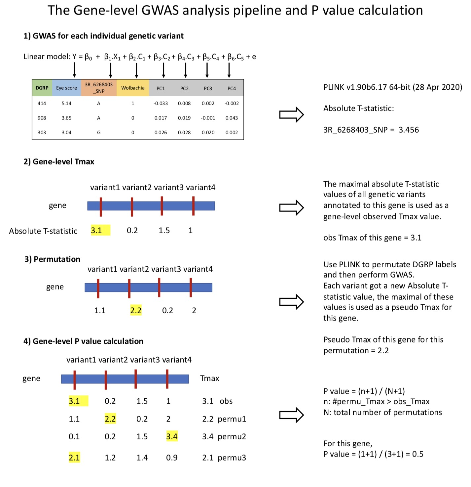
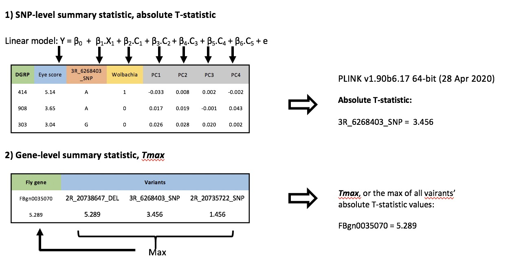
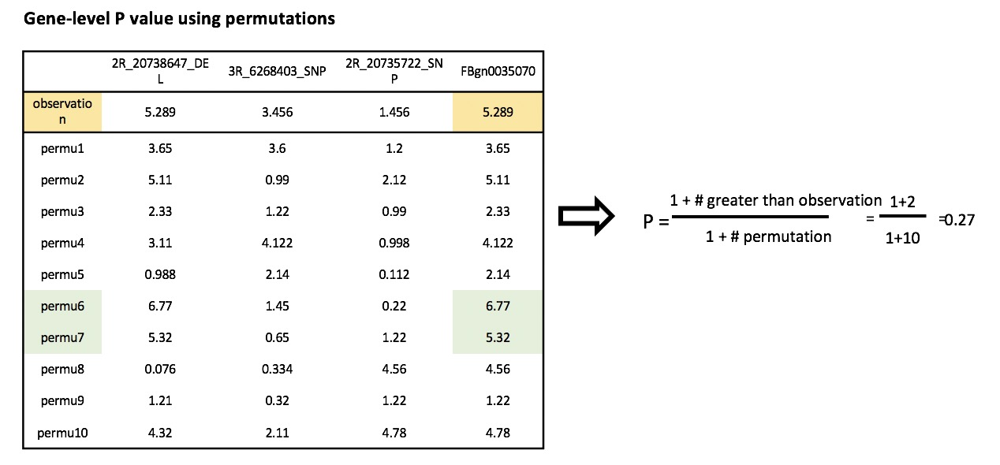

```{r setup, include=FALSE}
knitr::opts_chunk$set(echo = T,message = F,warning = F,
        fig.width=6,fig.height=4,cache = F,
        #fig.show='hold',
        fig.align='center')
knitr::opts_knit$set(root.dir = getwd())
library(reshape2)
library(RVenn)
library(ggrepel)
library("biomaRt")
library(gplots)
library(knitr)
library(tidyverse)
library(readxl)
library("scatterplot3d") 
library(pander)
library(qqman)
library(clusterProfiler)
library(AnnotationDbi)
library(org.Dm.eg.db,verbose=F,quietly=T)
```

In this markdown file, I will show how to calculate a gene-level P value based on the GWAS (genome-wide association) outputs and permutations using **PLINK v1.90b6.17 64-bit (28 Apr 2020)**.

# Pipeline overview




- PLINK performs GWAS analysis on each individual genetic variant and outputs a **Absolute T statistic** which is related to this genetic variant's p value as its significance of asscoation with the eye score phenotype.

- We utilzied this **Absolute T statistic** and collected all genetic variants annotated to one gene. The maximal of these collected values was used as the observed gene-level Tmax value.

- We generated a null distribution of Tmax for one gene using a permutation procedure. We used PLINK to permutate DGRP labels among samples and then performed GWAS analysis as before. Each genetic variant got a new **Absolute T statistic** value. Similary, the maxmial was taken used as a pseudo Tmax value for one gene.

- We calcualted a empricial P value by comparing the observed Tmax value with all pseudo Tmax values. 

$P value = (n+1)/(N+1)$

n: the number of permutations whose pseudo Tmax is greater than the observed Tmax value

N: total number of permutations


## 1) GWAS for each individual genetic variant

Input files for single variant GWAS analysis include: 

+ DGRP genotype information: 
    + dgrp2.bed
    + dgrp2.fam
    + dgrp2.bim
* DGRP phenotype information: eye-pheno.txt
* DGRP covariates information: eye-assoc.txt 

DGRP variants information could be downloaded from oneline database [dgrp2](http://dgrp2.gnets.ncsu.edu/data.html) –> Genotype files –> 2.Plink formatted genotype (BED/BIM/FAM)

The above three (BED/BIM/FAM) files are ~400MB.

The detailed description of how to generate the above files can be found in `02_gene.level.gwas.html`.


Command line of a single variant GWAS analysis:

program information: **PLINK v1.90b6.17 64-bit (28 Apr 2020) ** www.cog-genomics.org/plink/1.9/

> plink --bfile ../dgrp2/dgrp2-162lines.maf0.05 --pheno ../input_files/eye-pheno.txt --covar ../input_files/eye-assoc.txt keep-pheno-on-missing-cov --linear hide-covar --out plink

For one gene, I collected the `T` values of its annotated genetic variants, then took the maximal as this gene’s observed `Tmax` value.




## 2) perform permutations using PLINK to assess the significance of the observed `Tmax` value for each gene, I referred to this significance as `Pgene`.

I used a `Max(T) permutation` approach (https://www.cog-genomics.org/plink/1.9/assoc#perm) and perform 10,000 permutations for each variant. 

Each permutation was implemented by randomzing the DGRP line labels and a pseudo `T` value was calcualted for each genetic variant.

I got one pseudo `Tmax` value for one gene in each permutation following the same approach as calculating the observed Tmax per gene. Just repeat it here, for each permutation, for one gene, I collected the `T` values of its annotated variants and took the maximal as a pseudo `Tmax` value for this gene.

The final gene-level P value, or `Pgene`, was calculated as the number of permutations whose `Tmax` was larger than the observed Tmax divided by the total number of permutations.




Command line of permutation for one gene in PLINK:

> plink --bfile ../dgrp2/dgrp2-162lines.maf0.05 --allow-no-sex --pheno ../input_files/eye-pheno.txt --covar ../input_files/eye-assoc.txt keep-pheno-on-missing-cov --linear hide-covar mperm=10000 --mperm-save-all --extract ../gene-snp-files/FBgn0000003 --out FBgn0000003 --seed 123456

There is one input file named 'FBgn0000003', it a file listing all genetic variants annotated to fly gene FBgn000000.
It looks like this:
```{r class.source = 'fold-show',eval=F}
$ cat FBgn0000003
3R_2649413_INS
3R_2648879_SNP
3R_2649403_DEL
3R_2648934_SNP
3R_2649180_SNP
```

Below I will use this gene as a example to show the procedures of calcualting a gene-level p value.

# run permutations for one gene

```{r eval=F}
# bash commands, do not run in R
$ plink --bfile ../GWAS.analysis/dgrp2/dgrp2-162lines.maf0.05 --allow-no-sex --pheno ../GWAS.analysis/input_files/eye-pheno.txt --covar ../GWAS.analysis/input_files/eye-assoc.txt keep-pheno-on-missing-cov --linear hide-covar mperm=10000 --mperm-save-all --extract ./FBgn0000003 --out FBgn0000003 --seed 123456
```

I set the number of permuations to be 10000 by setting `mperm=10000`.

After I run this commond line in the terminal or on the server, 4 files would be generated.

File `FBgn0000003.mperm.dump.all` is what I needed for Pgene calculation.


Have a look at the first 10 lines of this file:
```{r eval=F}
$ head FBgn0000003.mperm.dump.all 
0 1.0663 1.06725 0.0272167 1.89822 1.43981
1 1.70325 1.79711 1.05418 1.9562 1.58662
2 1.05975 0.874642 0.244292 1.24483 1.42665
3 0.513909 0.153987 2.10116 0.605101 0.389493
4 0.382951 0.603283 0.219729 0.51558 0.000128834
5 0.460079 1.191 0.711428 1.90192 0.807202
6 0.138299 0.0939229 0.398204 0.00944182 0.375548
7 1.79665 1.87069 0.446474 1.34697 1.31322
8 1.17781 0.918618 0.297721 0.707799 1.04068
9 1.12769 1.21694 0.535438 0.686373 1.16369

$ wc -l FBgn0000003.mperm.dump.all 
   10001 FBgn0000003.mperm.dump.all
```

You may notice, this file has 10001 lines instead of 10000 lines.
The reason is that the first line is the observed `T` values for the four variants, and the following 10000 lines are the pseudo `T` values calculated from the 10000 permutations.


# calcualte the observed and all pseudo Tmax values for each gene

I used `awk` to process this `FBgn0000003.mperm.dump.all` file.
```{r eval=F}
awk '{m=$2;for(i=2;i<=NF;i++)if($i>m)m=$i;print m}' FBgn0000003.mperm.dump.all >all.Tmax.values
```

The above line extracts the maximal value per line of the `FBgn0000003.mperm.dump.all` file.

# compare the observed and all pseudo Tmax values to get gene-level p value
```{r eval=F}
$ awk 'BEGIN{c=0;n=0}{if(NR==1)a=$1;else if(NR>1 && $1>a) c=c+1;n=n+1 } END{print a,c,n-1}' all.Tmax.values
1.89822 1767 10000
```

The output has three numbers: `1.89822 1767 10000`

- The fisrt number is the observed `Tmax` vale.
- The second number is the number of permutations which has a larger pseudo `Tmax` value than the observed one.
- The third number is the total number of permutations.

If you are familiar with bash programming, you could combine the above two `awk` commands into one sentence:
```{r eval=F}
awk '{m=$2;for(i=2;i<=NF;i++)if($i>m)m=$i;print m}' FBgn0000003.mperm.dump.all | awk 'BEGIN{c=0;n=0}{if(NR==1)a=$1;else if(NR>1 && $1>a) c=c+1;n=n+1 } END{print a,c,n-1}' -
```

Thus, `Pgene` of FBgn0000003 is (1+1767)/(1+10000) = 0.1767.

###  R Session Information
```{r}
sessionInfo()
#installed.packages()[names(sessionInfo()$otherPkgs), "Version"]
```

